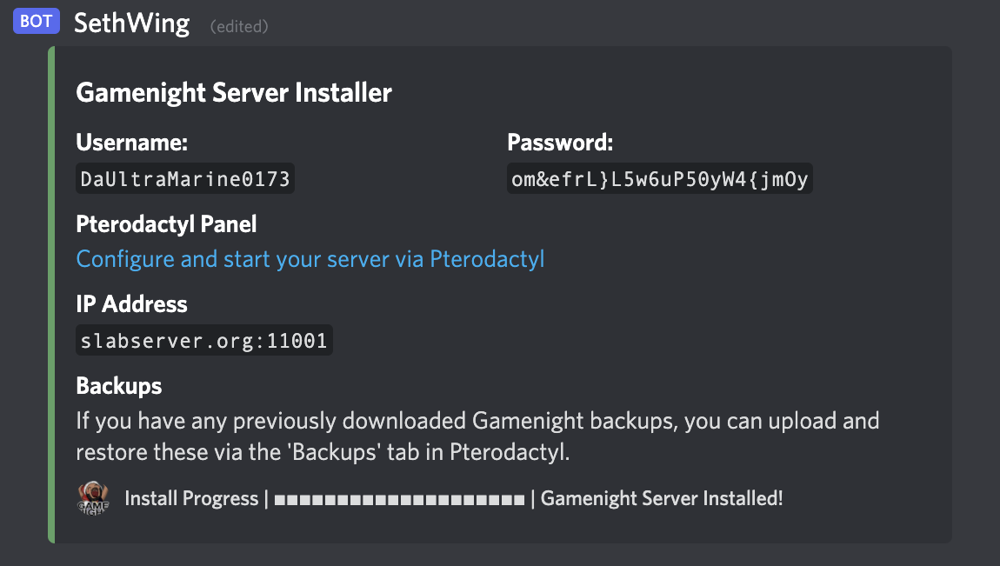
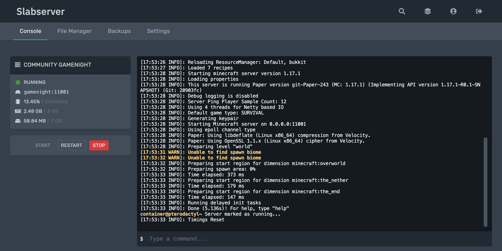
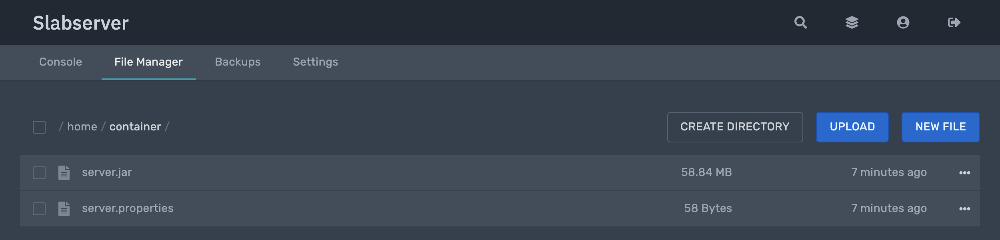
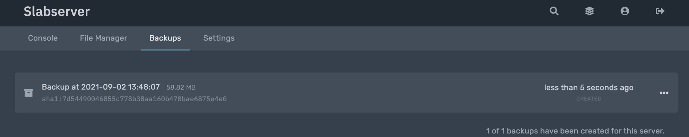

# Gamenight Servers

The **Gamenight Server Installer** (_affectionately known as the Slabserver Server Server_) is a feature of our Discord Bots. It provides a temporary server in a matter of seconds, ready to be configured in any way you desire, with any settings, plugins, or maps.

These servers automatically delete after 72 hours, meaning we take care of almost all server management aspects and allow you to focus on organizing your gamenight.

!!! info
    If you need to host a longer-term server or gamenight over several weeks, the staff team can create a server without auto-deletion. Please request one from the staff team or via Modmail, along with a brief justification.

## Creating a Gamenight Server

### Basic Setup

Simply type the `/gamenight` command to create a server. This will use the latest [PaperMC](https://papermc.io/) version.



### Installing other Minecraft servers

You can optionally provide a `server:` field, to install different Minecraft server types:

```console
/gamenight server:Paper (Recommended) 
/gamenight server:Vanilla
/gamenight server:UHC
```

- **Paper** is our recommended server installation, offering better performance and supporting plugins.
- **UHC** is identical to Paper, but installs the latest version of the [UhcCore](https://www.spigotmc.org/resources/uhccore.102507/) plugin alongside the server.
- **Vanilla** is Mojang's own server files, offering no plugin support but supports much older versions of Minecraft, as covered below.

### Installing other Minecraft versions

You can optionally provide a `version:` field, to install previous Minecraft versions. The versions you can install depends on the type of server you choose to install. 

- For Paper and UHC servers, the version must match one from the [Paper API](https://papermc.io/api/v2/projects/paper).

- For Vanilla Minecraft, the version must match one from the [Vanilla manifest](https://launchermeta.mojang.com/mc/game/version_manifest.json).

Example options are:
```console
/gamenight version:1.15
/gamenight server:UHC version:1.15
/gamenight server:Vanilla version:20w06a
```

!!! info
    `/gamenight` can only support Vanilla releases, pre-releases, or snapshots newer than Minecraft 1.2.5.

## Managing a Gamenight Server

### Pterodactyl Panel

When your gamenight server has installed, you'll be provided with a username, password, and link to our Pterodactyl panel where you can manage your server. Upon logging in, you'll see the server overview page, where clicking on your gamenight server will navigate you to the Console.

### Server Console

The Console tab allows you to start, restart, stop and kill your server, as well as run server commands. By default, your gamenight server will be powered off, and needs to be started manually.



### File Manager

The File Manager tab allows you interact with the server files.

At first, only the `server.jar` and `server.properties` are present. Other files are generated once you start the server for the first time, which you'll need to do to use a whitelist, or add other plugins.

If you need to make frequent or larger file transfers, SFTP credentials are available via the **Settings** tab.



## Backups

The Backups tab allows you to have your gamenight events or maps continue over several weeks, have a restore point for your events, or to provide a world download after an event.



### Creating a backup

To get started, Click **Create Backup**. No name is required, and leaving this field blank will default to `'Backup at <date> <time>'`. There should be no need to ignore files, directories, or lock the backup.

Backups take the form of `.tar.gz` files for easy sharing, and are easily unzipped by common programs such as WinZip, 7Zip, WinRAR, or Archive Utility. 

!!! note
    In order to limit the amount of storage that gamenight servers use, you may only create one backup at a time.

### Restoring a backup

#### Existing servers

To restore a backup for an existing server, select `...` to the right side of the backup and then **Restore**. Select **Remove all files and folders before restoring this backup**, and then select **Restore Backup**.

#### Newly installed servers

To restore a backup to a newly installed server, simply delete the `server.jar` and `server.properties`, and upload the `.tar.gz` backup file you wish to restore. This can take several seconds to complete. Once this `.tar.gz` is visible in the File Manager, right click the file and select **Unarchive**.

### Deleting a backup

If you wish to delete a backup for a currently installed server, in order to make another backup, select `...` to the right hand side of the backup and then select **Delete**.

!!! note
    If you have for some reason locked your backup, you will need to click 'Unlock' before being able to delete it.