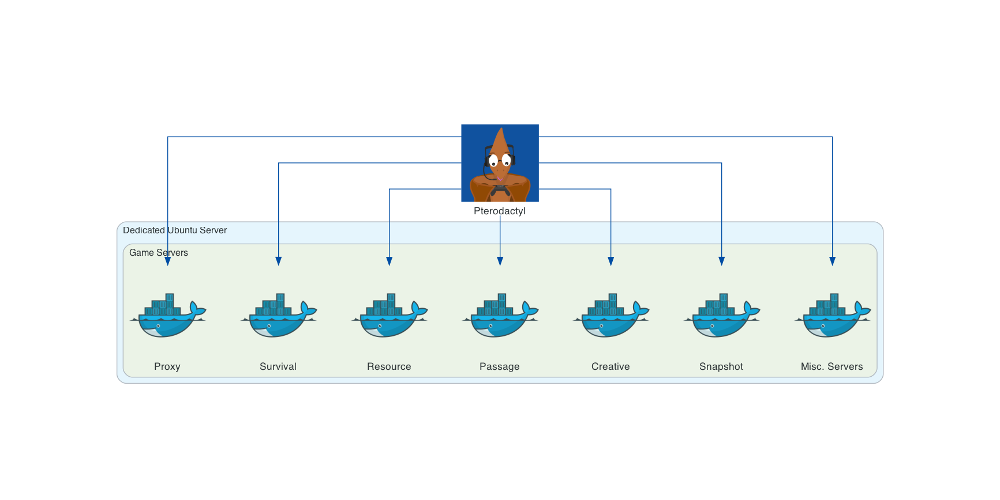
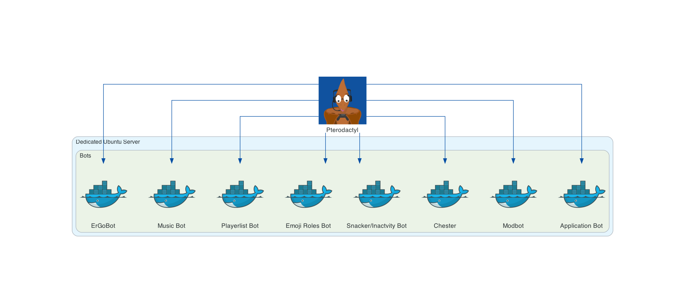
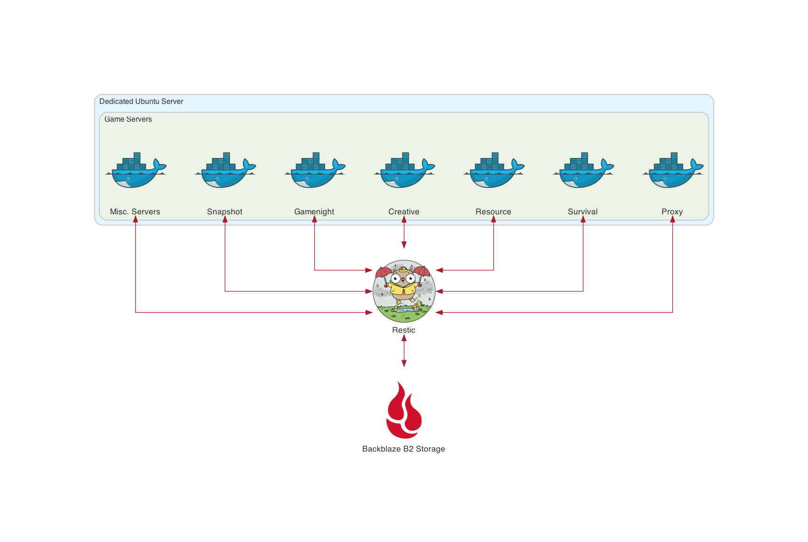

## Introduction

Our game servers are hosted on a dedicated Ubuntu server in Falkenstein, Germany, rented from Hetzner as a custom [AX42](https://www.hetzner.com/dedicated-rootserver/ax42/configurator) machine. Alongside the standard 2x 512GB SSDs configured in RAID, we’ve added a 1TB SSD for non-Survival game servers, and a 22TB HDD for backups and cold storage.

To configure and manage our game servers and various community bots on this Ubuntu server, we rely on the [Pterodactyl](https://pterodactyl.io/) server management panel.

## Game Servers

Pterodactyl runs all of our game servers in isolated Docker containers. We can then manage these game servers through the Pterodactyl UI panel, as well as the SFTP access it provides.

## Proxy Network

We use a BungeeCord server, referred to as our Proxy server, to connect several servers together, and tie the Resource World and The Passage into our Survival experience. 

Our proxy network handles connections to and from the Survival, Resource, and Passage servers that sit 'below' the Proxy in the hierarchy, and these servers are collectively considered to be our "Main" server.

The Proxy server utilises a shared set of MySQL databases for a number of use cases:

- __Whitelist database__
    - Writes to this database to whitelist new players.
        - _NB: Our whitelist applies to all servers within both proxy servers._
    - Reads from this database to authenticate connections.
- __AdvancedBan database__
    - Reads from this database to prevent banned members connecting.
        - _NB: Our banlist applies to all servers within both proxy servers._
- __LuckPerms database__
    - Reads from this database to synchronise permissions across the Bungee network.
- __PremiumVanish database__
    - Reads from this database to synchronise staff members vanished status across the Bungee network.

In addition to the Proxy Databases, we use more MySQL databases in the main network for the following use cases:

- __Resource World Gatekeeper database__
    - Writes to this database to save entity data before transferring servers
    - Reads from this database to load entity data upon transferring servers
- __CoreProtect database__
    - Writes to this database to log player progression and history
    - Reads to this database to restore previous server data
- __Plan database__
    - Writes to this database to log player analytics

For all of our databases, [phpMyAdmin](https://www.phpmyadmin.net/) provides a useful web interface for access and administration.

As noted in the diagram, the Resource server does not interact with the Survival server directly, and vice versa. Players are transferred from one server to another via the Proxy. The same is true of chatlogs too - note that messages are also not sent from the Resource Server to `#ingamechat` directly.
 

### Staging Network

Our "Main" server has an equivalent "Test" server, known as [Staging](https://wikipedia.org/wiki/Deployment_environment#Staging), which we use to prepare our server upgrades.

As Minecraft updates increased in both frequency and technical complexity, the work required for updating our plugins, datapacks, and server configuration also increased.

By using a Production <-> Staging server setup, we are able to 'pull' everything on Slabserver to our Staging server, update our plugins and datapacks, and then 'push' those changes up to Slabserver. 

This lets us gradually prepare Staging over several days, test Staging before 'pushing' the changes, and minimise how long Slabserver is offline for the 'push' update. This is all managed via a bespoke [CLI](https://simple.wikipedia.org/wiki/Command-line_interface) tool known as [SlabCLI](https://github.com/Slabserver/slabcli).

## Bots

While detailed here in their own section, these bots are hosted and managed via Pterodactyl much like our game servers. In fact, for Pterodactyl and Docker there is almost no functional difference between a game server and a bot. Hosting these bots via Pterodactyl helps to keep most staff applications managed through a single functional UI.

We run bots on our dedicated server for the following use cases:

- **Appbot**  
*Sends server applications to an `#applications` channel, and whitelist commands to our servers*
- **Modbot**  
*Shares IPs, posts FAQs, checks pings, converts timezones, restarts servers, sends reminders (and plenty more!)*
- **Chester**  
*Forwards any DM or completed Member Report that you send it to a private staff channel*
- **Emoji Roles**  
*Assigns roles when reacting to certain messages, as seen in our #welcome channel*
- **Playerlistbot**  
*Checks player count and player statuses across Survival and Resource servers when `!playerlist` is used in `#ingamechat`*
- **Snackers**  
*Posts Etho-themed welcome messages in #general, and assigns the 'Inactive' role to members if they do not speak in the Discord for three weeks*
- **MusicBot**  
*Plays YouTube and Soundcloud songs in our voice channels, utilising a [publicly available bot](https://github.com/jagrosh/MusicBot)*
- **ErgoBot**  
*Runs automation tasks on our Pterodactyl servers based on API responses from external services, for example Mojang's version manifest*

## Backups

Our backups work through a combination of [Restic](https://restic.net/) and [Backblaze](https://www.backblaze.com/b2/cloud-storage.html). Restic provides automated [incremental backups](https://en.wikipedia.org/wiki/Incremental_backup) solution for all our server data, while Backblaze provides us with insanely cheap external storage, to avoid the dedicated server being a single point of failure.

We currently keep between 28 and 42 days worth of incremental backups on Backblaze, to balance the amount of available backups with the costs of storing and pruning this data. Pruning to 28 days is automatically run by a cronjob on the 1st and 15th of each month.

Rendered with [Diagrams](https://diagrams.mingrammer.com) by mingrammer

