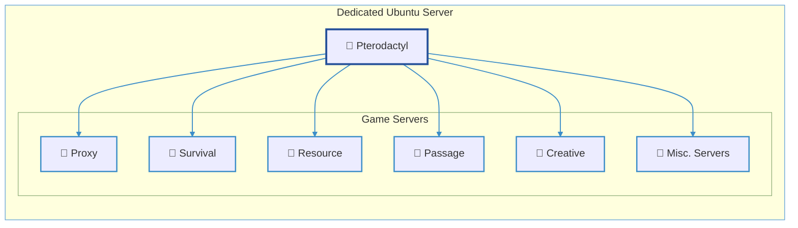
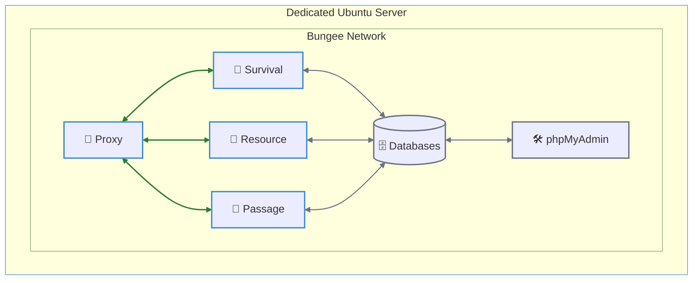
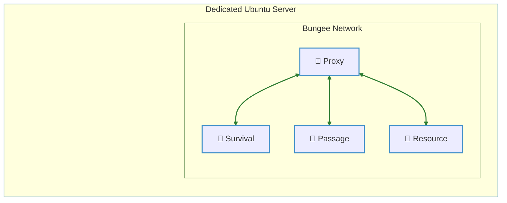
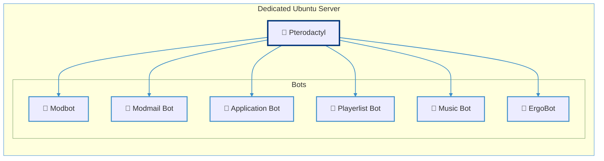
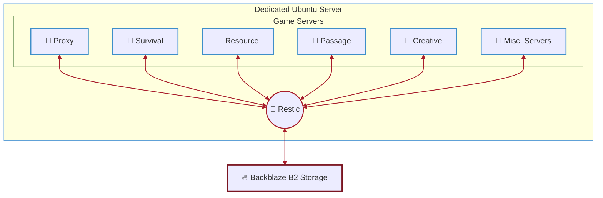

## Introduction

Our game servers are hosted on a dedicated Ubuntu server in Falkenstein, Germany, rented from Hetzner as a custom [AX42-U](https://www.hetzner.com/dedicated-rootserver/ax42-u/configurator/#/) machine. Alongside the standard 2x 512GB SSDs configured in RAID, we’ve added a 1TB SSD for non-Survival game servers, and a 22TB HDD for backups and cold storage.

To configure and manage our game servers and various community bots on this Ubuntu server, we rely on the [Pterodactyl](https://pterodactyl.io/) server management panel.

## Game Servers

Pterodactyl runs all of our game servers in isolated Docker containers. We can then manage these game servers through the Pterodactyl UI panel, or the [SFTP](https://simple.wikipedia.org/wiki/SSH_file_transfer_protocol) access it provides.

```mermaid
flowchart TD

    subgraph server["Dedicated Ubuntu Server"]
        direction TB
        pterodactyl["🦖 Pterodactyl"]
        subgraph games["Game Servers"]
            direction LR
            proxy["🐳 Proxy"]
            survival["🐳 Survival"]
            resource["🐳 Resource"]
            passage["🐳 Passage"]
            creative["🐳 Creative"]
            misc["🐳 Misc. Servers"]
        end
    end

    pterodactyl --> proxy
    pterodactyl --> survival
    pterodactyl --> resource
    pterodactyl --> passage
    pterodactyl --> creative
    pterodactyl --> misc

    classDef pdactyl stroke:#26519A,stroke-width:3px
    classDef container stroke:#3d8ec9,stroke-width:2px

    class pterodactyl pdactyl
    class proxy,survival,resource,passage,creative,misc container

    style server stroke:#5c9fd6,stroke-width:1px
    style games stroke:#8fae7a,stroke-width:1px

    linkStyle default stroke:#3d8ec9,stroke-width:1.5px
```

## Proxy Network

We use a BungeeCord server (also known as our Proxy server) to connect several of our servers together, synchronising features such as [player list](https://minecraft.wiki/w/Multiplayer#Player_list) and [chat](https://minecraft.wiki/w/Chat) between them to create a shared Survival experience.

Our proxy network handles connections to and from the Survival, Resource, and Passage servers that sit 'below' the Proxy in the hierarchy, and these servers are collectively considered to be our **Main** server.

```mermaid
flowchart TD
    subgraph server["Dedicated Ubuntu Server"]
        subgraph bungee["Bungee Network"]
            direction LR
            survival["🐳 Survival"]
            proxy["🐳 Proxy"]
            resource["🐳 Resource"]
            passage["🐳 Passage"]
        db[("🗄️ Databases")]
        phpmyadmin["🛠️ phpMyAdmin"]
        end
    end

    proxy <--> survival
    proxy <--> resource
    proxy <--> passage

    survival <--> db
    resource <--> db
    passage <--> db
    db <--> phpmyadmin

    classDef container stroke:#3d8ec9,stroke-width:2px
    classDef data stroke:#6b7280,stroke-width:2px

    class proxy,survival,resource,passage container
    class db,phpmyadmin data

    style server stroke:#5c9fd6,stroke-width:1px
    style bungee stroke:#8fae7a,stroke-width:1px

    linkStyle 0 stroke:#2e7d32,stroke-width:2px
    linkStyle 1 stroke:#2e7d32,stroke-width:2px
    linkStyle 2 stroke:#2e7d32,stroke-width:2px
    linkStyle 3 stroke:#6b7280,stroke-width:1.5px
    linkStyle 4 stroke:#6b7280,stroke-width:1.5px
    linkStyle 5 stroke:#6b7280,stroke-width:1.5px
    linkStyle 6 stroke:#6b7280,stroke-width:1.5px
```

### Staging Network

The **Main** server has an equivalent **Test** server (also known as our [Staging](https://wikipedia.org/wiki/Deployment_environment#Staging) server), where we prepare server upgrades.

As Minecraft updates have increased in both frequency and technical complexity, the work required for updating our plugins, datapacks, and server configuration also increased.

With our Staging setup, we are able to 'pull' everything from Main to the Staging server, update our plugins and datapacks, and then 'push' those changes up to Main. 

This lets us gradually prepare Staging over several days, test Staging before 'pushing' the changes, and minimise how long Slabserver is offline for the 'push' update. This is all managed via a bespoke [CLI](https://simple.wikipedia.org/wiki/Command-line_interface) tool known as [SlabCLI](https://github.com/Slabserver/slabcli).

## Databases

```mermaid
flowchart LR
    subgraph server["Dedicated Ubuntu Server"]
        subgraph bungee["Bungee Network"]
            direction TB
            survival["🐳 Survival"]
            proxy["🐳 Proxy"]
            passage["🐳 Passage"]
            resource["🐳 Resource"]
        end
        subgraph notbungee["Non-Bungee Network"]
            direction LR
            creative["🐳 Creative"]
            misc["🐳 Misc. Servers"]
        end
    end

    proxy <--> survival
    proxy <--> passage
    proxy <--> resource


    classDef container stroke:#3d8ec9,stroke-width:2px
    classDef invisible fill-opacity:0, stroke-opacity:0, color:#0000;

    class proxy,survival,resource,passage container
    class notbungee,creative,misc invisible

    style server stroke:#5c9fd6,stroke-width:1px
    style bungee stroke:#8fae7a,stroke-width:1px

    linkStyle 0 stroke:#2e7d32,stroke-width:2px
    linkStyle 1 stroke:#2e7d32,stroke-width:2px
    linkStyle 2 stroke:#2e7d32,stroke-width:2px

```

The Proxy server utilises a shared set of MySQL databases for a number of use cases:

- __Whitelist database__
    - Writes to this database to whitelist new players.
        - _NB: Our whitelist applies to all servers within both proxy servers._
    - Reads from this database to authenticate connections.
- __AdvancedBan database__
    - Reads from this database to prevent banned members connecting.
- __LuckPerms database__
    - Reads from this database to synchronise permissions across the Bungee network.
- __PremiumVanish database__
    - Reads from this database to synchronise staff members vanished status across the Bungee network.

In addition to the Proxy Databases, we use more MySQL databases in the main network for the following use cases:

- __Resource World Gatekeeper database__
    - Writes to this database to save entity data before transferring servers
    - Reads from this database to load entity data upon transferring servers
- __CoreProtect database__
    - Writes to this database to log player progression and history
    - Reads to this database to restore previous server data
- __Plan database__
    - Writes to this database to log player analytics

For all of our databases, [phpMyAdmin](https://www.phpmyadmin.net/) provides a useful web interface for access and administration.
 

## Bots

Our bots are also hosted on the Ubuntu server and managed via Pterodactyl, just like any of our game servers. This helps the staff team to configure and manage most of our staff applications through a single application.

```mermaid
flowchart TD
    subgraph server["Dedicated Ubuntu Server"]
        direction TB
        pterodactyl["🦖 Pterodactyl"]
        subgraph bots["Bots"]
            direction LR
            modbot["🐳 Modbot"]
            modmailbot["🐳 Modmail Bot"]
            applicationbot["🐳 Application Bot"]
            playerlistbot["🐳 Playerlist Bot"]
            musicbot["🐳 Music Bot"]
            ergobot["🐳 ErgoBot"]
        end
    end

    pterodactyl --> modbot
    pterodactyl --> modmailbot
    pterodactyl --> applicationbot
    pterodactyl --> playerlistbot
    pterodactyl --> musicbot
    pterodactyl --> ergobot

    classDef pdactyl stroke:#00337a,stroke-width:3px
    classDef container stroke:#3d8ec9,stroke-width:2px

    class pterodactyl pdactyl
    class ergobot,musicbot,playerlistbot,modmailbot,modbot,applicationbot container

    style server stroke:#5c9fd6,stroke-width:1px
    style bots stroke:#8fae7a,stroke-width:1px

    linkStyle default stroke:#3d8ec9,stroke-width:1.5px
```

We run bots on our dedicated server for the following use cases:

- **Modbot**  
*Shares IPs, posts FAQs, checks pings, converts timezones, restarts servers, sends reminders, posts our Etho-themed join messages, assigns Snacker, Inactive, and self-assigned #welcome roles (and does plenty more!)*
- **Modmail Bot**  
*Forwards any DM or completed Member Report that you send @Chester to a private staff channel*
- **Appbot**  
*Sends server applications to an `#applications` channel, and whitelist commands to our servers*
- **Playerlist Bot**  
*Checks player count and player statuses across the Proxy servers when `!playerlist` is used in `#ingamechat`*
- **Music Bot**  
*Plays YouTube and Soundcloud songs in our voice channels, utilising a [publicly available bot](https://github.com/arif-banai/MusicBot)*
- **ErgoBot**  
*Runs automation tasks on our Pterodactyl servers based on API responses from external services, for example Mojang's version manifest*

## Backups

### Full Backups
Internal backups of our game servers are made daily, in the early EU hours. These backups are also uploaded to a private cloud storage bucket on [Backblaze](https://www.backblaze.com/b2/cloud-storage.html), offering us [data redundancy](https://en.wikipedia.org/wiki/Data_redundancy) via their relatively cheap external storage compared to other providers.

We currently keep 7 days worth of daily backups on both our dedicated server and Backblaze, as well as 4 weeks worth of weekly backups on Backblaze.

### Incremental Backups
Our [Incremental backups](https://en.wikipedia.org/wiki/Incremental_backup) run via a combination of [Restic](https://restic.net/) and [Backblaze](https://www.backblaze.com/b2/cloud-storage.html). Restic provides an automated incremental backup solution for all our server data, and Backblaze fulfils the same private cloud storage purpose as described in the [Full Backups](#full-backups) section above.

We currently keep between 28 and 42 days worth of incremental backups on Backblaze, to balance the amount of available backups with the costs of storing and pruning this data. Pruning to 28 days is automatically run by a cronjob on the 1st and 15th of each month.

```mermaid
flowchart TD
    subgraph server["Dedicated Ubuntu Server"]
        subgraph games["Game Servers"]
            direction LR
            proxy["🐳 Proxy"]
            survival["🐳 Survival"]
            resource["🐳 Resource"]
            passage["🐳 Passage"]
            creative["🐳 Creative"]
            misc["🐳 Misc. Servers"]
        end
        restic(("🔄 Restic"))
    end
    backblaze["🔥 Backblaze B2 Storage"]

    proxy <--> restic
    survival <--> restic
    resource <--> restic
    passage <--> restic
    creative <--> restic
    misc <--> restic
    restic <--> backblaze

    classDef container stroke:#3d8ec9,stroke-width:2px
    classDef restic stroke:#a81c2b,stroke-width:2px
    classDef backblaze stroke:#7a1420,stroke-width:3px

    class proxy,survival,resource,passage,creative,misc container
    class restic restic
    class backblaze backblaze

    style server stroke:#5c9fd6,stroke-width:1px
    style games stroke:#8fae7a,stroke-width:1px

    linkStyle default stroke:#a81c2b,stroke-width:1.5px
```

