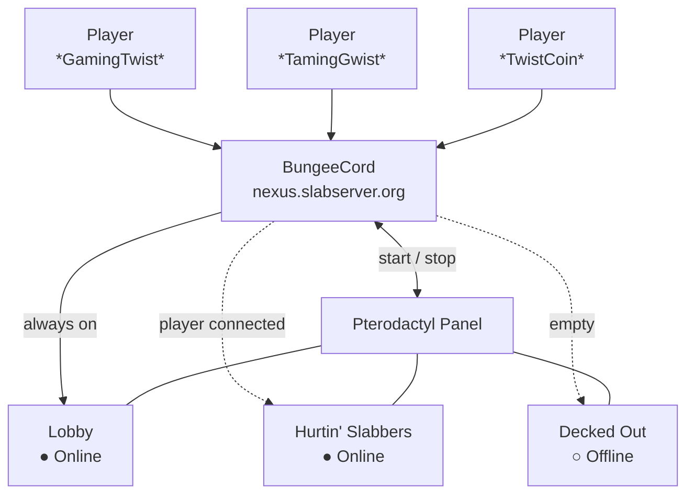
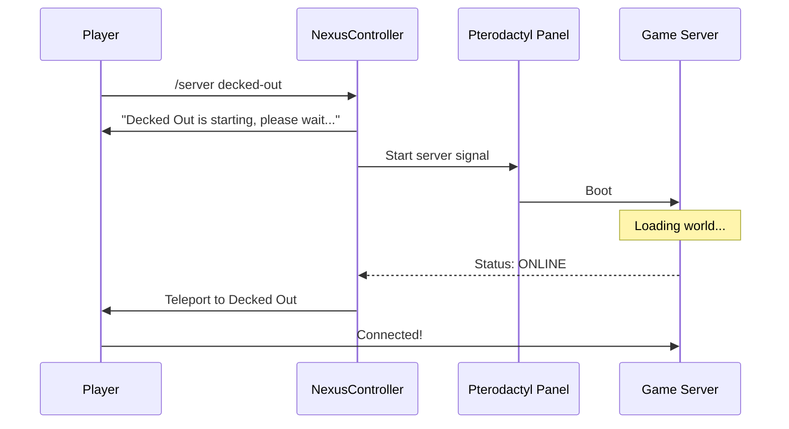

# The Network

## Overview

All players connect to a central BungeeCord proxy first. From there they hop to any game server. The proxy is the backbone of the network. Every feature shared across servers lives here. The is possible due to leveraging the pterodactly panel API for more info see [server architecture](../minecraft/server-architecture.md).

Players never connect directly to a game server. The proxy intercepts every connection. This is what makes on-demand server startup possible.

## Core Plugins

Three plugins run at the proxy level. Every server in the network inherits their effects automatically.

### NexusController

NexusController is the automation layer. It watches every server, reacts to players joining, and talks to the hosting panel to start or stop servers on demand.

### LuckPerms

[LuckPerms](https://luckperms.net/) handles permissions across the whole network. Ranks and permissions set here apply to every server a player connects to. No per-server configuration is needed.

### Bouncer

[Bouncer](https://github.com/Slabserver/bouncer) enforces the whitelist at the proxy level. Non-whitelisted players are stopped before they reach any server. The check happens once, at the point of entry, before any game server is involved.

### Spicord
[Spicord](https://www.spigotmc.org/resources/spicord.64918/) Framework that loads a [JDA](https://github.com/discord-jda/JDA) environment on to the proxy. Really easy to extend without needing to 

#### DCMessageBungee
DCMessageBungee by Twist to relay message to the discord bot from servers on the network such as DeckedOut posting the messages to the discord using the Spicord API.

#### BungeePlayerList
BungeePlayerList by Twist connects to the Spicord API and replys to the `playerlist` message showing where the players are on the network. Also uses [Levenshtein distance](https://en.wikipedia.org/wiki/Levenshtein_distance) to find misspelling and return a misspelt response back.

### SimpleProxyChat
[SimpleProxyChat](https://modrinth.com/plugin/simpleproxychat) *Planned to move away from to a Spicord approach* 

Discord chat runs at the proxy level. Because it sits on the proxy, every server in the network shares the same integration automatically.

- Messages sent in the linked Discord channel appear in-game on all servers.
- Messages sent in-game appear in Discord.
- Players on different servers see the same chat.
- Switching servers does not interrupt the chat connection.

No per-server setup is needed. Adding a new game server to the network gives it Discord chat without any extra work.

## On-Demand Servers

Game servers do not run constantly. When nobody is playing, a server shuts down to free up memory. The moment someone tries to join, NexusController starts it back up.

### Joining a Sleeping Server

1. You connect to the server (or type `/server <name>`) while it is offline.
2. NexusController intercepts the connection before it fails.
3. You get a message telling you the server is starting.
4. The server boots in the background. This takes 20 to 60 seconds depending on the server.
5. Once ready, you are moved there automatically. No action needed.

!!! info
    If multiple players try to join a sleeping server at the same time, they queue together and teleport as a group the moment the server is ready.

## Auto-Shutdown

When the last player leaves a game server, NexusController starts a short countdown. If nobody rejoins within the grace period, the server stops automatically. This keeps memory free for other servers.

The grace period covers short disconnections. If you drop and rejoin quickly, the server stays up.

## Memory Management

Every server uses a fixed amount of memory when running. NexusController tracks a shared memory pool across the machine. Before starting any server it checks available RAM. If there is not enough, the start is refused with an error message rather than overloading the host.

When a server shuts down, its memory returns to the pool immediately.

## Commands

| Command | What it does |
|---|---|
| `/nexus list` | Shows all servers and their current status |
| `/nexus status <server>` | Detailed status for one server |
| `/nexus free` | Shows current memory usage across the pool |

## Server Status Reference

| Status | Meaning |
|---|---|
| Offline | Server is shut down, using no memory |
| Starting | Boot signal sentp |
| Online | Running and accepting players |
| Stopping | Shutdown signal sent |

Status updates come from a live WebSocket connection to each server. If that connection drops, NexusController falls back to polling the panel every 20 seconds so status stays accurate.