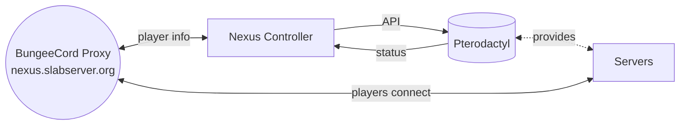
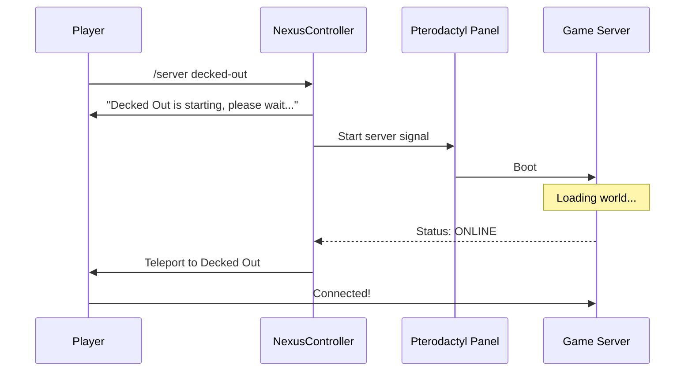

# Architecture

## Overview
When joining, players connect to the Nexus proxy which places them in the Lobby. From there, players use the lobby to locate and connect to any of the [available servers](index.md#available-servers), which start [on-demand](#on-demand-servers) as required.

```mermaid
flowchart LR

Proxy(("BungeeCord Proxy\nnexus.slabserver.org"))
Controller["Nexus Controller"]
Panel[("Pterodactyl")]
Servers[Servers]

Panel <-.-> |provides|Servers
Proxy <--> | players connect | Servers
Proxy <-->|player info| Controller
Controller -->|API| Panel
Panel -->|status| Controller
```

## Core Plugins
Three plugins run at the proxy level, and so their features work across every server automatically.

### Quick Reference

| Plugin                                                         | Description                                |
| -------------------------------------------------------------- | ------------------------------------------ |
| NexusController                                                | Server automation and lifecycle management |
| [LuckPerms](https://luckperms.net/)                            | Network wide permissions                   |
| [Bouncer](https://github.com/Slabserver/bouncer)               | Proxy whitelist enforcement                |
| [Spicord](https://www.spigotmc.org/resources/spicord.64918/)   | Discord bot framework on the proxy         |
| [SimpleProxyChat](https://modrinth.com/plugin/simpleproxychat) | Legacy Discord chat bridge                 |

### Plugin Descriptions

#### NexusController

NexusController is the automation layer, which watches every server, reacts to players joining, and talks to [Pterodactyl](../minecraft/server-architecture.md#introduction) to start or stop servers on demand.

#### LuckPerms
[LuckPerms](https://luckperms.net/) handles permissions across the whole network. Ranks and permissions set here apply to every server a player connects to. No per-server configuration is needed.

#### Bouncer
[Bouncer](https://github.com/Slabserver/bouncer) enforces the whitelist at the proxy level. Non-whitelisted players are stopped before they reach any server. The check happens once, at the point of entry, before any game server is involved.

#### Spicord Ecosystem

[Spicord](https://www.spigotmc.org/resources/spicord.64918/) loads a [JDA](https://github.com/discord-jda/JDA) environment onto the proxy for extending Discord integration.

##### DCMessageBungee
DCMessageBungee by Twist relays message to the Discord bot from servers, such as DeckedOut posting the messages to the Discord using the Spicord API.

##### BungeePlayerList
BungeePlayerList by Twist connects to the Spicord API and replys to the `playerlist` message showing what Nexus server players are on. Also uses [Levenshtein distance](https://en.wikipedia.org/wiki/Levenshtein_distance) to find misspelling and return a misspelt response back.

#### SimpleProxyChat Legacy
[SimpleProxyChat](https://modrinth.com/plugin/simpleproxychat) provides Discord chat at the proxy level. *Planned to move to a Spicord approach*.

As it sits on the proxy, every server in the network shares the same integrations automatically:

- Messages sent in the linked Discord channel appear in-game on all servers.
- Messages sent in-game appear in Discord.
- Players on different servers see the same chat.
- Switching servers does not interrupt the chat connection.

No per-server setup is needed. Adding a new server to the network provides Discord chat by default.

## On-Demand Servers

Game servers do not run constantly. When nobody is playing, a server shuts down to free up memory. The moment someone tries to join, NexusController starts the server for them automatically.

### Joining an Offline Server

1. Players connect to the server (or type `/server <name>`) while it is offline.
2. NexusController intercepts the connection before it fails.
3. Players get a message telling them the server is starting.
4. The server starts in the background. This takes 20 to 60 seconds, depending on the server.
5. Once the server is ready, players are moved to it automatically.

```mermaid
sequenceDiagram
    participant P as Player
    participant NC as NexusController
    participant Panel as Pterodactyl Panel
    participant S as Game Server

    P->>NC: /server decked-out
    NC->>P: "Decked Out is starting, please wait..."
    NC->>Panel: Start server signal
    Panel->>S: Boot
    Note over S: Loading world...
    S-->>NC: Status: ONLINE
    NC->>P: Teleport to Decked Out
    P->>S: Connected!
```
!!! info
    If multiple players try to join an offline server at the same time, they queue together and teleport as a group the moment the server is ready.

## Auto-Shutdown

When the last player leaves a game server, NexusController starts a short countdown. If nobody rejoins within the grace period, the server stops automatically. This keeps memory free for other servers.

The grace period covers short disconnections. If players drop and rejoin quickly, the server stays online.

## Memory Management

Every server uses a fixed amount of memory when running. NexusController tracks a shared memory pool across the machine. Before starting any server it checks available RAM. If there is not enough, the start is refused with an error message rather than overloading the host.

When a server shuts down, its memory returns to the pool immediately.

## Commands

| Command | What it does |
|---|---|
| `/nexus list` | Shows all servers and their current status |
| `/nexus status <server>` | Detailed status for one server |
| `/nexus free` | Shows current memory usage across the pool |

## Server Status Reference

| Status | Meaning |
|---|---|
| Offline | Server is shut down, using no memory |
| Starting | Boot signal sentp |
| Online | Running and accepting players |
| Stopping | Shutdown signal sent |

Status updates come from a live WebSocket connection to each server. If that connection drops, NexusController will fall back to polling the panel every 20 seconds so the status stays accurate.