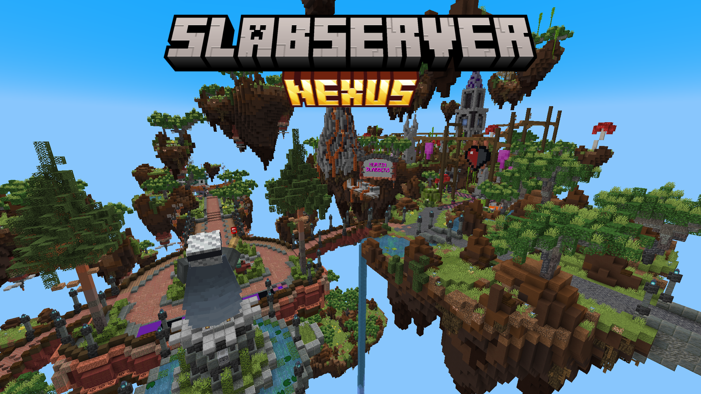

# The Nexus

The **Nexus** is Slab's archive and minigame server. It uses ViaVersion on all the servers allowing 1.21.4+ clients to join.

The Nexus is not a replacement for the popular public servers. It is a place for content that belongs to Slab, built around this community's history.

The server has a history of games built and played in survival mode. They were fun, but survival has limits. Items run out; Things get broken; Only one version exists. The Nexus fixes that. Games get instancing, build protection, and automated resets so they work as proper multiplayer experiences without losing what made them fun the first time.

## Philosophy

Two goals drive everything here.

The first is preservation with improvement. The game stays the same. The experience improves. For example In the case of Hurtin' Slabbers a deliberate decision was made to keep the poison even if the heath could have been set via commands.

The second is exclusivity. Some content exists only here. Not ports of other servers. Things built around this community, available nowhere else.

## Help out
If you think of a server that meets the philosophy of the server and you want to add it. Message @gamingtwist on discord or Chester to relay the message.

## What's Available

- [Hurtin' Slabbers](./hurtin-slabbers/index.md) by Maketues (Server by Twist)
- [Decked Out](./decked-out/index.md) by Master2Dex and Menscraft (+ other members) (Server by Twist)
- [Spectator Servers](./spectator-servers/index.md) (Server by Twist)

## Planned

- Tunnel Server
- Hunger Games server (slab maps)

## How It Works

Each game runs on its own standalone server. Servers start on demand when a player wants to join, and shut down when nobody is playing. This keeps resources free and gives precise control over each game.

[Read more about the network and infrastructure.](./architecture.md)