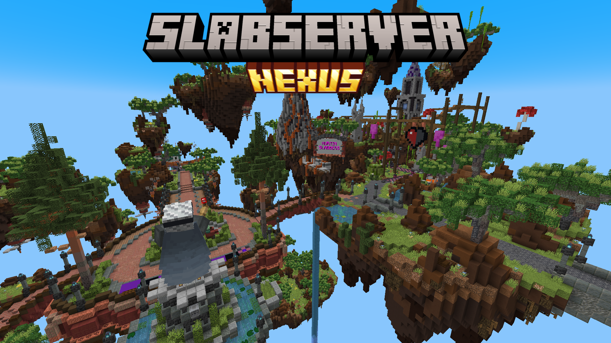

# The Nexus

The **Nexus** is Slab's archive and minigame server. Every server on it runs ViaVersion, so any 1.21.4+ client can join.

The Nexus isn't trying to replace the big public minigame servers. It's a home for content that belongs to Slab and is built around this community's history.

Over the years, players have built and played plenty of games in survival. They were fun, but survival has limits: items run out, things get broken, and only one copy exists. The Nexus fixes that. Games get instancing, build protection and automatic resets, so they work as proper multiplayer experiences without losing what made them fun the first time.

## Philosophy

Two goals drive everything here.

**Preserve, but improve.** The game stays the same while the experience around it gets better. For example, Hurtin' Slabbers deliberately keeps its poison, even though health could have been set with commands.

**Exclusive to Slab.** Some content exists only here. These aren't ports of other servers. They're built around this community and aren't available anywhere else.

## What's Available

| Server | What it is | Made by |
|---|---|---|
| [Decked Out](https://wiki.slabserver.org/nexus/decked-out/) | Multiplayer dungeon crawler inspired by TangoTek's Hermitcraft game | Master2Dex, Menscraft and others |
| [Hurtin' Slabbers](https://wiki.slabserver.org/nexus/hurtin-slabbers/) | Parkour platformer with 8 levels and a boss fight | Maketues |
| [Spectator Servers](https://wiki.slabserver.org/nexus/spectator-servers/) | Read-only archive of Slab's past worlds | - |

All servers are run by Twist. Each link opens the game's guide on the [Slab Wiki](https://wiki.slabserver.org/nexus/), where anyone can help keep it up to date.

## Planned

- Tunnel Server
- Hunger Games server (using Slab maps)

## Help Out

Have an idea for a server that fits the philosophy above? Message @gamingtwist on Discord, or ask Chester to pass it on.

## How It Works

Each game runs on its own standalone server. A server starts when a player wants to join and shuts down when nobody is playing, which keeps resources free and gives precise control over each game.

[Read more about the network and infrastructure.](./architecture.md)
