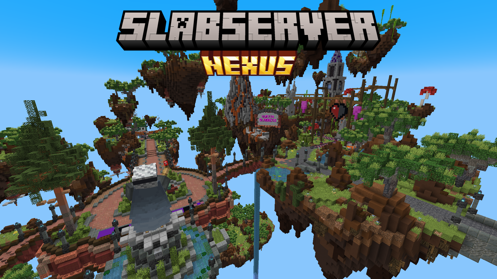

# The Nexus

The **Nexus** server acts as a hub for replaying community experiences which were previously created as one-off events or our previous Survival seasons. The server is created and maintained by GamingTwist.

 If you would like to see something added to the Nexus, Message @GamingTwist or Chester on Discord.

## Available Servers

| Server | What it is | Made by |
|---|---|---|
| [Decked Out](https://wiki.slabserver.org/nexus/decked-out/) | Dungeon crawler inspired by TangoTek's Hermitcraft game | Master2Dex, Menscraft and others |
| [Hurtin' Slabbers](https://wiki.slabserver.org/nexus/hurtin-slabbers/) | Parkour platformer inspired by Etho's Hermitcraft game  | Maketues |
| [Spectator Servers](https://wiki.slabserver.org/nexus/spectator-servers/) | Read-only archive of Slabserver's previous seasons | - |

