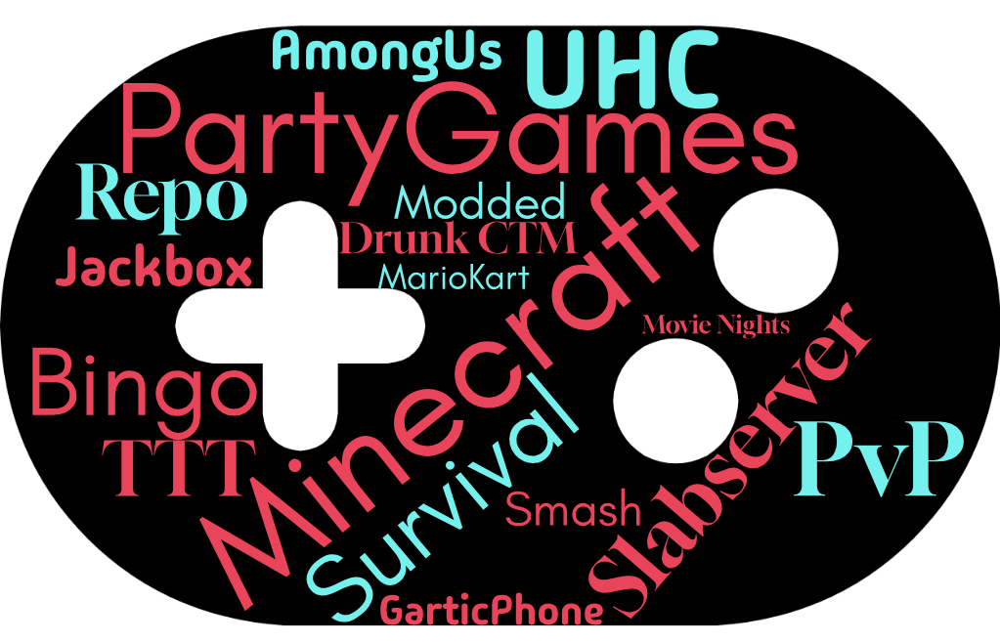
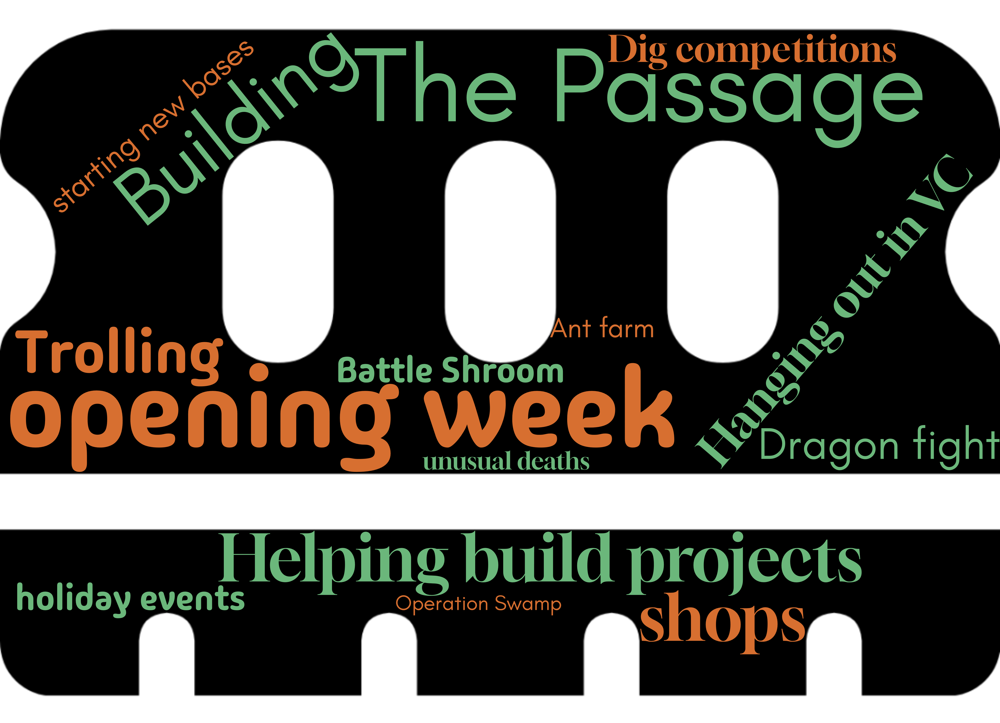

# The Great Slabserver Poll 2026 Results

## General 

### What age category are you in?
*Question 1*

  
failed to load

### How do you identify your gender?
*Question 2*

  
failed to load

### What country do you live in?
*Question 3*

  
failed to load

    <button class="md-button md-button--primary toggle" type="button">
    Toggle View
  </button>

### What country US state do you live in?
*Question 4*

  
failed to load

    <button class="md-button md-button--primary toggle" type="button">
    Toggle View
  </button>

### What UTC offset are you in?
*Question 5*

  
failed to load

### How many languages do you speak?
*Question 6*

  
failed to load

### What editions of Minecraft do you play?
*Question 7*

  
failed to load

### What devices do you play Minecraft on?
*Question 8*

  
failed to load

      <button class="md-button md-button--primary toggle" type="button">
    Toggle View
  </button>

### How long have you been part of the Discord/Slabserver community?
*Question 9*

  
failed to load

### How did you end up joining the Discord and/or Community Servers?
*Question 10*

  
failed to load

### How often do you watch Etho's videos?
*Question 11*

  
failed to load

### Which series of new Etho episodes did you watch during 2025?
*Question 12*

  
failed to load

        <button class="md-button md-button--primary toggle" type="button">
    Toggle View
  </button>

### Are there any other Hermits that you regularly watch??
*Question 13*

  
failed to load

      <button class="md-button md-button--primary toggle" type="button">
    Toggle View
  </button>

## Community

### What's your favourite part of our Discord?
*Question 15*
{ loading=lazy }

### What is your favourite channel?
*Question 16*

  
failed to load

### Which is your favourite robot overlord? (Discord bot)?
*Question 17*

  
failed to load

## Gamenights

### Have you taken part in Gamenight events hosted within the Discord?
*Question 18*

  
failed to load

### Have you organized a Gamenight before?
*Question 19*

  
failed to load

### On a scale from 1 to 5, how well do you feel #gamenight functions in its current form?
*Question 21*

  
failed to load

### Do you think #gamenight would be improved by making it a forum channel (such as #feedback or #community-bulletin) with one post/thread per game or even gamenight?
*Question 22*

  
failed to load

### Do you think #gamenight needs a slowmode?
*Question 23*

  
failed to load

### What games or voice channel activities would you like to see more Gamenights organized for?
*Question 24*
{ loading=lazy }

## Discord

### On a scale of 1 to 5, how much do you use each of the following categories of our Discord?
*Question 26*

  
failed to load

## Slabserver Wiki

  
failed to load

## Nexus

### Have you played on the Nexus server?

  

### What is your favourite server on the Nexus?
*Question 44*

  
failed to load

## Survival

### Do you play on our Survival server? 
*Question 47*

  
failed to load

### What is your favourite memory of Season 4 so far?
*Question 48*
{ loading=lazy }

## What's your favourite area on the server?
*Question 49*
{ loading=lazy }

### What do you think of the current way Phantoms are handled on Slabserver?
*Question 51*

  
failed to load

### Do you use a vanilla or modded Minecraft client?
*Question 54*

  
failed to load

### If you use a modded Minecraft client, what's the one Minecraft mod you can't live without on Slabserver?
*Question 55*
{ loading=lazy }

### Do you use any resource packs on Slabserver? 
*Question 56*

  
failed to load

### Do you believe that the blockExplosionDropDecay and mobExplosionDropDecay gamerules should be set to False?
*Question 57*

  
failed to load

### Do you see yourself making/updating any farm(s) to use the new blockExplosionDropDecay and mobExplosionDropDecay gamerules within the next 12 months, if the gamerule was changed?
*Question 58*

  
failed to load

### Should such a change be trialed in the Resource World first, if the gamerule was changed?
*Question 59*

  
failed to load

## Extra

### Minecraft Movie

"After the unfortunate success of 'A Minecraft Movie' last year, and having now acquired Warner Bros, Netflix have realised that there is no depths of quality that a sequel could sink to, that doesn't also make them another $950 million.

The previous lead CGI expert at Warner Bros has also mysteriously vanished in Florida, with reports that he was eaten by a bald green man vaguely resembling Shrek.

Netflix is therefore in dire need of a new ""Chicken Jockey"" for ""A Minecraft Movie 2"", and is refusing to spend the budget to hire someone new. 

You may therefore pick TWO members of the staff team to play the Chicken Jockey. Who do you choose to play the Chicken, who do you choose to play the Jockey, and why?"

  
failed to load

### What significance does our community hold to you? What is most important to you within our community, and what does it represent for you?
*Question 69*
{ loading=lazy }

### Total Playtime by country

  

    <button class="md-button md-button--primary toggle" type="button">
    Toggle View
  </button>

