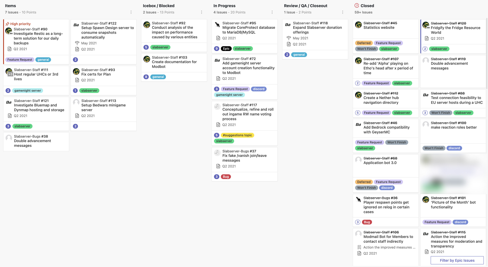

# May 2021
<!-- more -->
### Donation Breakdown
**Breakdown Between 5th Of April - 5th Of May:**

Costs/Donations |      $
---|---
Monthly Paypal Donations¹| $124.88
Monthly Patreon Donations¹| $82.50
Total Donations (Month)| $207.38
Existing Rollover Donations| $00.00
---|---
Server Cost²| -$65.99
---|---
**Remaining Donation Funds**³   |  **$141.39**

---

### State of the Slab
**Current staff tasks being tracked as of 8th of May 2021⁴:**

Here's a recap of the staff team actions throughout the past month:

- We introduced a new Staff Member, Chester, to provide an alternative means of contacting us for those that feel less comfortable messaging one of us directly. Chester has had a lot of modmail messages since joining the team, keep them coming!

- We wrote a collection of [documentation](./../../../documentation/) to increase our transparency around infrastructure, plugins, and staff processes.

- We launched our new TerraFirmaCraft server, once more unto the breach of modded server headaches.

- We added a ['Picture of the Month'](https://discord.com/channels/146701388234227712/813525859696377896/837840821217787935) functionality to Modbot, after it was raised in [#suggestions](https://discord.com/channels/146701388234227712/549320896590905344/814204632300781598)

- We made a couple of improvements to our dear Survival server:
    - Fixed a bug where [player respawn points would get ignored on relog](https://github.com/DaMarine/Slabserver-Bugs/issues/36).
    - Re-added the much loved feature from Season 2 where the song ‘Alpha' would playing on Etho's head after 20 seconds.

- We said goodbye to Frogperson, who decided to retire from the staff team.
    - We've deferred a number of our kanban tasks that were associated with Frog, though may revisit these again in the future.

- We 'fridgified' the Resource World, after the community sacrificed any good naming convention in the name of... kitchen appliances.

- We begun early discussions and preparations for our 1.17 update this summer - stay tuned for more information once Mojang announce an official date.

---

### Server Donation Links
Paypal: [https://slabserver.org/paypal](https://slabserver.org/paypal)

Patreon: [https://slabserver.org/patreon](https://slabserver.org/patreon)

---

¹ Donation amount listed is after transaction fees have taken place.

² The dedicated server hosts all of our game servers, databases, as well as our various Discord bots. You can find more detail on this [in our documentation](../../../documentation/minecraft/server-architecture.md).

³ Unless disclosed otherwise, this will always be put forward towards next months server costs, and will be displayed in ‘rollover donations’ within the transparency report.

⁴ There will be occasions that certain items on the board are redacted, should they still be in [draft](https://docs.github.com/en/issues/planning-and-tracking-with-projects/managing-items-in-your-project/adding-items-to-your-project#creating-draft-issues), or contain sensitive tasks or information.