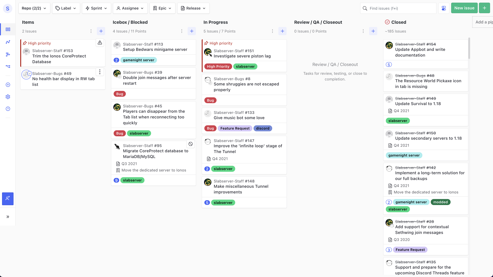

# February 2022
<!-- more -->
### Donation Breakdown
**Breakdown Between 5th Of January - 5th Of February:**

Costs/Donations |      $
---|---
Monthly Paypal Donations¹| $10.50
Monthly Patreon Donations¹| $89.40
Monthly Cryptocurrency Donations¹| $0
Total Donations (Month)| $99.90
Existing Rollover Donations| $521.25
---|---
Dedicated Server Cost²| -$82.93
---|---
**Remaining Donation Funds** ³   |  **$538.22**

---

### Important Clarification and Amendment Regarding Server Costs

While we've always believed that our Ionos server would be costing us $100 USD, closer inspection of the automatic billing via Paypal revealed that despite payments being listed as $100, it's actually in Canadian dollars, and the conversion rate can only be seen [upon inspecting the transaction further](https://i.imgur.com/6BZujQw.png). In the unlikely event that anyone from Paypal reads this, please know this is _really_ bad UX.

This was missed in January's transparency report due to thinking that the discrepancy in calculated funds vs actual funds was a result of donations made after the 5th of Jan. I've fixed Jan's transparency report and sincerely apologise for the mistake, I always strive to be 100% accurate with these given that this is a community fund. Aside from this mistake, this just means our new server is costing us less than we expected.

---

### State of the Slab
**Current staff tasks being tracked as of 20th of February 2022⁴:**

**Here's a recap of the staff team actions throughout the last month:**

- We helped Tylertron get a modded server up and running, replicating Etho’s ongoing Modded Season 2. Things have been running much better recently despite a tricky technical start, but I’d also like to take a moment to thank Tyler for his vigilance in running the Modded server, it’s been a far harder task than any of us would have imagined!

- We’ve backported the [JustEnoughDiscordIntegration](https://www.curseforge.com/minecraft/mc-mods/just-enough-discord-integration) mod to 1.16.5. We couldn’t find any decent Discord plugins for Forge that didn’t have stability issues, and so hope that this can be an asset to the wider modded Minecraft community too!

- We now have our weekly full server backups being exported to Backblaze, courtesy of some Python scripting. Over the past few months our recovery measures have been vastly improved by our Ionos RAID 1 storage and Incremental backups, but ensuring we have maximum disaster recovery has been a long time coming for us and an important mitigation measure to have.

- We’ve swapped our InventoryRollback plugin to a fan continuation, InventoryRollbackPlus - due to the former no longer receiving updates. This isn’t an interesting change at all, and was missed from last month’s transparency report, but I’ve had a couple of requests to make sure we document when plugin changes happen, so here you go!

- We ran The Great Slabserver Poll of 2022 to gather some more feedback from the community and gain a better understanding of our demographic, particularly with the increase in members around the start of Etho's Modpack. As of the time of writing we're still reviewing the hefty amount of feedback we received (190 responses!) though hope to have lots of resulting actions to share in the next transparency report.

---

### Server Donation Links
Paypal: [https://slabserver.org/paypal](https://slabserver.org/paypal)

Patreon: [https://slabserver.org/patreon](https://slabserver.org/patreon)

---

¹ Donation amount listed is after transaction fees have taken place.

² The dedicated server hosts all of our game servers, databases, as well as our various Discord bots. You can find more detail on this [in our documentation](../../../documentation/minecraft/server-architecture.md).

³ Unless disclosed otherwise, this will always be put forward towards next months server costs, and will be displayed in ‘rollover donations’ within the transparency report.

⁴ There will be occasions that certain items on the board are redacted, should they still be in [draft](https://docs.github.com/en/issues/planning-and-tracking-with-projects/managing-items-in-your-project/adding-items-to-your-project#creating-draft-issues), or contain sensitive tasks or information.