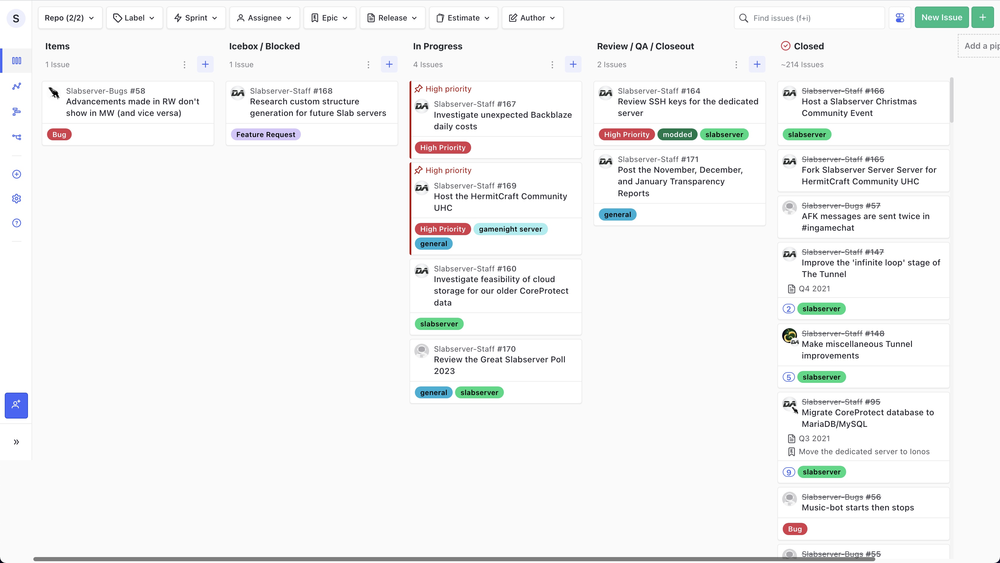

# January 2023
<!-- more -->
### Donation Breakdown
**Breakdown Between 5th Of December - 5th Of January:**

Costs/Donations |      $
---|---
Monthly Paypal Donations¹| $6.08
Monthly Patreon Donations¹| $56.06
Monthly Cryptocurrency Donations¹| $0
Total Donations (Month)| $62.14
Existing Rollover Donations| $357.79
---|---
Dedicated Server Cost²| -$85.99
---|---
**Remaining Donation Funds** ³   |  **$333.94**

---

### State of the Slab
**Current staff tasks being tracked as of 15th January 2023⁴:**

**Here's a recap of the staff team actions throughout January:**

- We released The Great Slabserver Poll of 2023, gathering demographics, suggestions, and feedback from the community. We got a whopping 216 responses this year, more than ever before, and are going to take the next couple of weeks to discuss and work through the results. Keep an eye on #suggestions in case we decide to bring any of it to the community, and also #announcements for the full results soon!

- We updated all of our servers to 1.19.3, after a hesitant rollout due to the number of backend changes Mojang have made with the experimental 1.20 changes included in this update.
    - For those who may still be wondering, we have no intentions of enabling the experimental features on our survival server. Both Paper and Mojang have made clear that there will be no official support or upgrade paths for worlds that enable these features.

---

### Server Donation Links
Paypal: [https://slabserver.org/paypal](https://slabserver.org/paypal)

Patreon: [https://slabserver.org/patreon](https://slabserver.org/patreon)

---

¹ Donation amount listed is after transaction fees have taken place.

² The dedicated server hosts all of our game servers, databases, as well as our various Discord bots. You can find more detail on this [in our documentation](../../../documentation/minecraft/server-architecture.md).

³ Unless disclosed otherwise, this will always be put forward towards next months server costs, and will be displayed in ‘rollover donations’ within the transparency report.

⁴ There will be occasions that certain items on the board are redacted, should they still be in [draft](https://docs.github.com/en/issues/planning-and-tracking-with-projects/managing-items-in-your-project/adding-items-to-your-project#creating-draft-issues), or contain sensitive tasks or information.