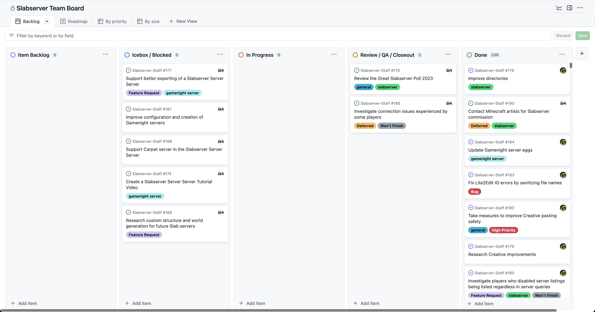

# August 2023
<!-- more -->
### Donation Breakdown
**Breakdown Between 5th Of July - 5th Of August:**

Costs/Donations |      $
---|---
Monthly Paypal Donations¹| $17.52
Monthly Patreon Donations¹| $61.79
Monthly Cryptocurrency Donations¹| $0
Total Donations (Month)| $79.31
Existing Rollover Donations| $218.49
---|---
Dedicated Server Cost²| -$88.71
---|---
**Remaining Donation Funds**³   |  **$209.09**

---

### State of the Slab
**Current staff tasks being tracked as of 5th August 2023⁴:**

**Here's a recap of the staff team actions throughout the last month:**

- We updated our Survival and Creative servers to 1.20.1.

- We did some behind-the-scenes pruning of our storage, most notably of CoreProtect. For now, this only affects entity deaths more than 6 months old.

- We contacted an artist from /r/minecraft to inquire about commissioning slabserver artworks, and hope that in the future we'll have more to share from them!

---

### Server Donation Links
Paypal: [https://slabserver.org/paypal](https://slabserver.org/paypal)

Patreon: [https://slabserver.org/patreon](https://slabserver.org/patreon)

---

¹ Donation amount listed is after transaction fees have taken place.

² The dedicated server hosts all of our game servers, databases, as well as our various Discord bots. You can find more detail on this [in our documentation](../../../documentation/minecraft/server-architecture.md).

³ Unless disclosed otherwise, this will always be put forward towards next months server costs, and will be displayed in ‘rollover donations’ within the transparency report.

⁴ There will be occasions that certain items on the board are redacted, should they still be in [draft](https://docs.github.com/en/issues/planning-and-tracking-with-projects/managing-items-in-your-project/adding-items-to-your-project#creating-draft-issues), or contain sensitive tasks or information.