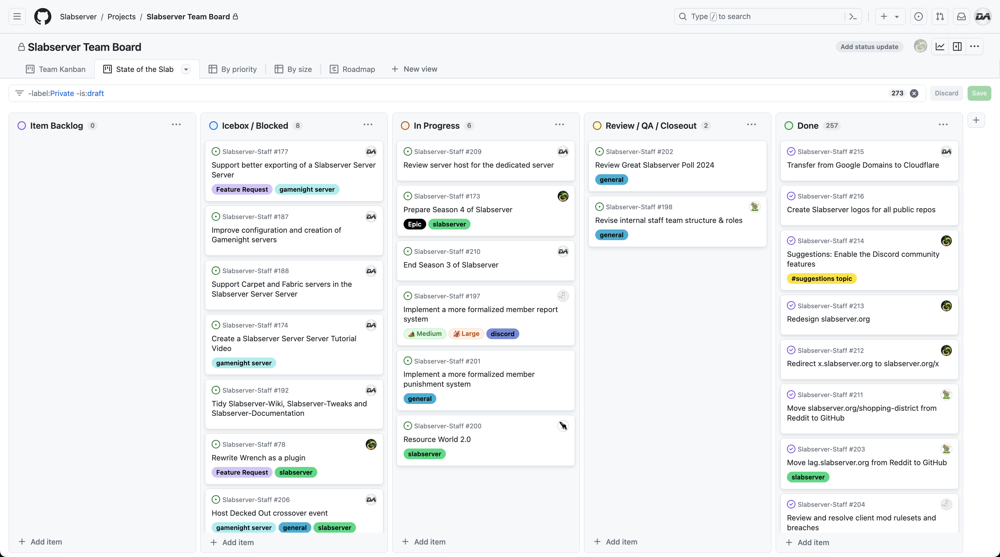

# May 2024
<!-- more -->
### Donation Breakdown
**Breakdown Between 5th Of April - 5th Of May:**

Costs/Donations |      $
---|---
Monthly Patreon Donations¹| $83.01
Monthly Paypal Donations¹| $6.08
Total Donations (Month)| $89.09
Existing Rollover Donations| $235.00
---|---
Dedicated Server Cost²| -$85.26
Cloudflare Transfer / Renewal Fee | -$10.11
---|---
**Remaining Donation Funds**³   |  **$228.72**

---

### State of the Slab

**Current staff tasks being tracked as of 6th May 2024⁴:**

**Here's a recap of the staff team actions throughout the last month:**
- We've finished the transfer of our `slabserver.org` domain over to Cloudflare, completing the work started last month.
  -  In order to transfer a domain to a new registrar, the domain has to be renewed for another year, which means that we now have the `slabserver.org` domain until at least February 2027.
- We've done a small restructuring of our Staff roles, and moved all current moderators to the Admins role - more green, woo!
  -  The differences between Community Moderators and Admins had been slowly becoming less and less meaningful since it's introduction, and so for clarity, we decided that it would make sense for our Discord roles to more closely represent our actual roles as staff members.
  - This also gives us room to expand the staff team structure with different kinds of roles in the future, focused on smaller aspects of the community to avoid stretching our team members too thin. The details of this are not yet finalized, so stay tuned.
- We've launched the Season 4 Community Project Signups, looking for people to help with various parts of designing our Spawn and Nether Hub. You can sign up over in #community-bulletin, and we'll be keeping the form open for a week from the date of this Transparency Report.
- We've started to really ramp up our work behind-the-scenes ahead of S4, which means a bit of a lighter Transparency Report this month in terms of actions. A lot is in progress, and much of it not visible on the Kanban Board⁴ - I hope to have the board reflect more of this work by next month, and you'll see a lot more from us over the next few months as we continue into S4.

---

### Server Donation Links
Paypal: [https://slabserver.org/paypal](https://slabserver.org/paypal)

Patreon: [https://slabserver.org/patreon](https://slabserver.org/patreon)

---

¹ Donation amount listed is after transaction fees have taken place.

² The dedicated server hosts all of our game servers, databases, as well as our various Discord bots. You can find more detail on this [in our documentation](../../../documentation/minecraft/server-architecture.md).

³ Unless disclosed otherwise, this will always be put forward towards next months server costs, and will be displayed in ‘rollover donations’ within the transparency report.

⁴ There will be occasions that certain items on the board are redacted, should they still be in [draft](https://docs.github.com/en/issues/planning-and-tracking-with-projects/managing-items-in-your-project/adding-items-to-your-project#creating-draft-issues), or contain sensitive tasks or information.
