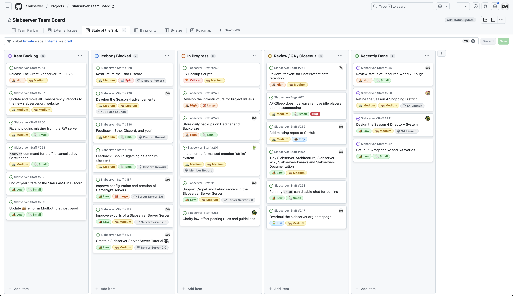

# December 2024

### Donation Breakdown
**Breakdown Between 5th Of November - 5th Of December:**

<!-- more -->

Costs/Donations |      $
---|---
Monthly Paypal Donations¹| $53.33
Monthly Patreon Donations¹| $78.54
Total Donations (Month)| $131.87
Existing Rollover Donations| $501.89
---|---
Dedicated Hetzner Server Cost² | -$110.63
---|---
**Remaining Donation Funds**³   |  **$523.13**

---

### State of the Slab

**Current staff tasks being tracked as of 25th December 2024⁴:**

**Here's a recap of the staff team actions throughout the last month:**

- We’ve overhauled [slabserver.org](https://slabserver.org) into a beautiful new website for our community! This website combines all the information from our old [Slabserver-Wiki](https://github.com/Slabserver/Slabserver-Wiki/wiki), [Slabserver-Tweaks](https://github.com/Slabserver/Slabserver-Tweaks/wiki), [Slabserver-Butts](https://github.com/Slabserver/Slabserver-Butts/wiki) and [Transparency-Reports](https://github.com/Slabserver/Transparency-Reports/wiki) repositories, in order to create a central ‘hub’ for all things Slabserver, complete with additional features like dark/light mode and site-wide search.
    - The new site is powered by [Material for MkDocs](https://squidfunk.github.io/mkdocs-material/), hosted on GitHub Pages, and fully [open-source](https://github.com/Slabserver/slabserver.github.io/), in order to make it as accessible and maintainable for our future as possible.
    - Want to help contribute to the site? Simply fork the project on GitHub, make some changes, and submit a pull request for us to review.
- We’ve created Pl3xmap sites for both [Season 2](https://s2map.slabserver.org/) and Season 3, as a general community resource and to be used as an embed in articles for the wiki project.
- We’ve worked closely with GamingTwist to get their wiki project out of alpha and publicly released to the community. This includes helping to create the [wiki signup form](https://forms.gle/4b7ksBW8YJj6oQox5), providing UX feedback for the site, suggesting the cover art competition, and even contributing an [example page](https://wiki.slabserver.org/The_Disc_11_Puzzle) to help others get started.
    - The wiki is now accepting contributions from anyone who has the Active and Whitelisted roles in our Discord, and can be found [here](https://wiki.slabserver.org).
- We’ve added replication between our database servers, in order to keep pruning the size of our live CoreProtect data while maintaining a full backup on our 22TB HDD used for storage.
    - Perhaps unsurprisingly, this caused no shortage of headaches and hard work for Chris for several weeks on end, especially some post-implementation fixes. The next time you think _“gosh golly gee isn’t coreprotect just so swell to have on Slab?"_, please think of Chris.
- We’ve updated our backup scripts to take advantage of our increased storage space with Hetzner. In addition to our existing daily incremental and weekly full backups, we’re now also taking full daily backups of our main servers, which are also securely stored externally on Backblaze.
- We fixed a bug with the `!c who <playername>` command in #ingamechat returning ‘nullnull’ as the name of the person being queried.
- We had a small crossover event with the Xisuma community, who hosted an open server weekend and extended an invitation to us as a thank you for organising the Decked Out crossover event.

---

### Server Donation Links
Paypal: [https://slabserver.org/paypal](https://slabserver.org/paypal)

Patreon: [https://slabserver.org/patreon](https://slabserver.org/patreon)

---

¹ Donation amount listed is after transaction fees have taken place.

² The dedicated server hosts all of our game servers, databases, as well as our various Discord bots. You can find more detail on this [in our butts](../../../butts/minecraft/server-architecture.md).

³ Unless disclosed otherwise, this will always be put forward towards next months server costs, and will be displayed in ‘rollover donations’ within the transparency report.

⁴ There will be occasions that certain items on the board are redacted, should they still be in [draft](https://docs.github.com/en/issues/planning-and-tracking-with-projects/managing-items-in-your-project/adding-items-to-your-project#creating-draft-issues), or contain sensitive tasks or information.

⁵ The [Priority](../../../assets/images/kanban/Priority.png) and [Size](../../../assets/images/kanban/Size.png) labels for our State of the Slab Board are a rough estimate of the amount of work involved, and quite honestly are just assigned based on vibes.
