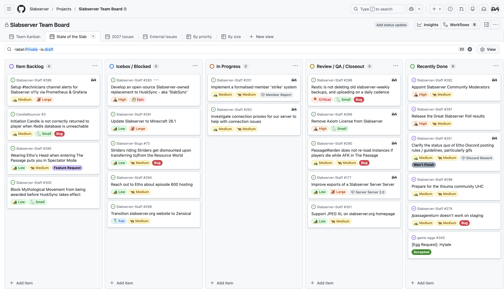

# March 2026
<!-- more -->
### Donation Breakdown
**Breakdown Between 1st Of February - 28th Of February:**

Costs/Donations |      $
---|---
Monthly Paypal Donations¹| $3.53
Monthly Patreon Donations¹| $94.87
Total Donations (Month)| $98.40
Existing Rollover Donations| $1039.35
---|---
Dedicated Hetzner Server Cost² | -$123.89
---|---
**Remaining Donation Funds**³   |  **$1013.86**

---

N.B. Hetzner are [increasing our dedicated server cost](https://www.hetzner.com/pressroom/statement-price-adjustment/) on the 1st of April 2026. Their [price adjustment page](https://docs.hetzner.com/general/infrastructure-and-availability/price-adjustment/) does not account for taxes, or our [custom hardware configuration](../../../../docs/documentation/minecraft/server-architecture.md#introduction) - though assuming the same percentage increase, our server costs will rise by ~21%, which will be reflected in the May 2026 Transparency Report.

---

### State of the Slab

**Current staff tasks being tracked as of 1st March 2026⁴⁵:**

**Here's a recap of the staff team actions throughout the last month:**

-  We released the [Great Slabserver Poll 2026 results](../../../polls/2026.md), taking slightly longer than previous years in order to improve our graphs and visualisations for the results. Even so, Twist went above and beyond with his work on this, and we appreciate all the positive responses to the results page this year.
    - We also hosted a **State of the Slab Live** to discuss some of the anonymised qualitiative feedback from The Great Slabserver Poll 2026 in more detail. The recording can be found [over on YouTube](https://www.youtube.com/playlist?list=PLAD59jwNidoAl1wpxzRyl1imds12-ppGW).
- We fixed an issue with our [external backups to Backblaze](../../../documentation/minecraft/server-architecture.md#backups) that was causing them to occur too frequently and not auto-delete after 28 days, both of which heavily inflated the monthly bill for Backblaze.
    - These external backups are still paid for directly, rather than via community donations, so the only damage here was to my own wallet.
- We made several quality of life updates to The Passage, namely some improvements to how 'The Soulvessel' item functionality works in the puzzle.
    - We also added some ingame words of encouragement for those who speedrun The Passage, assuming that the last major skip remains the optimal route for runs.
    - Another minor patch is currently in the final stages of development, aimed at addressing the last known softlocks and oversights within the puzzle. 
- We finished onboarding the Community Moderators, finishing up the last TODOs we had written up to get them all the access they required for their role.
    - One such example was our server panel, which had no way to add the Moderators to any new server, without giving them full permissions. This was solved with a custom script that now runs hourly to ensure their permissions are synced correctly to all servers within our panel.
- We've cancelled our Axiom license for Slabserver, 18 months later than we'd initially planned to! Axiom will still be available on the Creative server, though after March 6th 2026 it'll require a whitelist request in the [Axiom Discord](https://discord.com/invite/axiomtool) which lasts for 90 days, and can be requested as many times as you need.

---

### Server Donation Links
Paypal: [https://slabserver.org/paypal](https://slabserver.org/paypal)

Patreon: [https://slabserver.org/patreon](https://slabserver.org/patreon)

---

¹ Donation amount listed is after transaction fees have taken place.

² The dedicated server hosts all of our game servers, databases, as well as our various Discord bots. You can find more detail on this [in our documentation](../../../documentation/minecraft/server-architecture.md).

³ Unless disclosed otherwise, this will always be put forward towards next months server costs, and will be displayed in ‘rollover donations’ within the transparency report.

⁴ There will be occasions that certain items on the board are redacted, should they still be in [draft](https://docs.github.com/en/issues/planning-and-tracking-with-projects/managing-items-in-your-project/adding-items-to-your-project#creating-draft-issues), or contain sensitive tasks or information.

⁵ The [Priority](../../../assets/images/kanban/Priority.png) and [Size](../../../assets/images/kanban/Size.png) labels for our State of the Slab Board are a rough estimate of the amount of work involved, and quite honestly are just assigned based on vibes.
