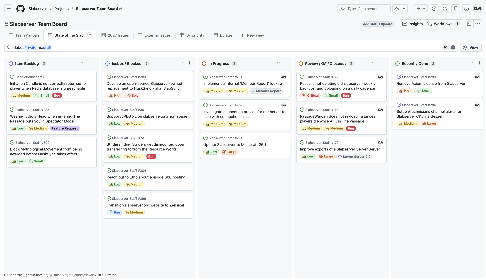

# April 2026
<!-- more -->
### Donation Breakdown
**Breakdown Between 1st Of March - 31st Of March:**

Costs/Donations |      $
---|---
Monthly Paypal Donations¹| $3.53
Monthly Patreon Donations¹| $113.22
Total Donations (Month)| $116.75
Existing Rollover Donations| $1013.86
---|---
Dedicated Hetzner Server Cost² | -$122.11
---|---
**Remaining Donation Funds**³   |  **$1008.50**

---

### State of the Slab

**Current staff tasks being tracked as of 13th April 2026⁴⁵:**

 - **N.B.** _"Implement a internal 'Member Report' lookup"_ is a rename of _"Implement a formalised member 'strike' system"_, to more accurately reflect its purpose - as the previous wording has worried a few people over time.
    - Its purpose has always been to have a better way of looking up a Member to see any reports and their outcomes, without being dependent on Discord's unreliable fuzzy search.

**Here's a recap of the staff team actions throughout the last month:**
- We hosted a rather elaborate April Fools' prank this year on Slabserver, which rebranded as SLABserver for the day.
  - You can see the full announcement [here](https://discord.com/channels/146701388234227712/146702455487463424/1488795095351300197), and relive the full experience at any point on `nexus.slabserver.org`.
  - A huge thanks once again to Twist for the original idea, and for implementing this year's April Fools!

- We updated [Etho's Wrench](../../../documentation/minecraft/tweaks/wrench.md) to work with the [Crafter](https://minecraft.wiki/w/Crafter) block, after numerous requests over the years... and despite Mojang's best attempts to make it as annoying as possible for us to implement.

- We fixed an issue where connecting to our SMP Network via our relay address (`p1.slabserver.org`) could reconnect players to a different server within the SMP network than our primary `slabserver.org` address would.

- We added an `@Overwatch` role for our [`#gamenight`](https://discord.com/channels/146701388234227712/279743857829347329) channel, after its recent resurgence in interest within the community.

- We've replaced our internal server monitoring system [Nagios](https://www.nagios.org) and our more recent [Grafana dashboard](https://grafana.com/grafana/dashboards/) setups with a more streamlined and lightweight tool called [Beszel](https://beszel.dev). Beszel seems to strike the best balance of features and simplicity for what we need, and is working pretty well so far!

---

The past month has been an incredibly busy time for me personally, and the remainder of April is likely to be as well - so expect a smaller State of the Slab in the May Transparency Report! And until then, we're focusing on upgrading the servers to Minecraft 26.1, whenever time allows.

---

### Server Donation Links
Paypal: [https://slabserver.org/paypal](https://slabserver.org/paypal)

Patreon: [https://slabserver.org/patreon](https://slabserver.org/patreon)

---

¹ Donation amount listed is after transaction fees have taken place.

² The dedicated server hosts all of our game servers, databases, as well as our various Discord bots. You can find more detail on this [in our documentation](../../../documentation/minecraft/server-architecture.md).

³ Unless disclosed otherwise, this will always be put forward towards next months server costs, and will be displayed in ‘rollover donations’ within the transparency report.

⁴ There will be occasions that certain items on the board are redacted, should they still be in [draft](https://docs.github.com/en/issues/planning-and-tracking-with-projects/managing-items-in-your-project/adding-items-to-your-project#creating-draft-issues), or contain sensitive tasks or information.

⁵ The [Priority](../../../assets/images/kanban/Priority.png) and [Size](../../../assets/images/kanban/Size.png) labels for our State of the Slab Board are a rough estimate of the amount of work involved, and quite honestly are just assigned based on vibes.
