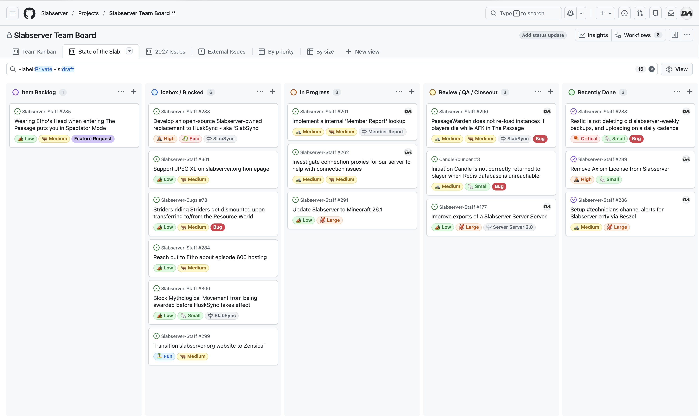

# May 2026
<!-- more -->
### Donation Breakdown
**Breakdown Between 1st Of April - 31st Of April:**

Costs/Donations |      $
---|---
Monthly Paypal Donations¹| $31.76
Monthly Patreon Donations¹| $112.09
Total Donations (Month)| $143.85
Existing Rollover Donations| $1008.50
---|---
Dedicated Hetzner Server Cost² | -$123.12
---|---
**Remaining Donation Funds**³   |  **$1029.23**

---

### State of the Slab

**Current staff tasks being tracked as of 1st May 2026⁴⁵:**

**Here's a recap of the staff team actions throughout the last month:**

- We've had a quieter month overall, as we said would be the case in our April Transparency Report. Those of us involved in technical work have been tied up with a number of IRL things, but we'll have more to share next month.
    - Aside from the usual day to day moderation bits, the main focus for us is getting our servers upgraded to Minecraft 21.6 and above.
        - Paper had to make signfiicant changes for Minecraft 26.1, and the HuskSync plugin, which we heavily depend on, has had no activity from both its owner and maintainer.
        - We are currently scheduling some time as staff to discuss our best steps forward with Minecraft 26.1 and HuskSync, and should hopefully have some info within the next two weeks.

---

### Server Donation Links
Paypal: [https://slabserver.org/paypal](https://slabserver.org/paypal)

Patreon: [https://slabserver.org/patreon](https://slabserver.org/patreon)

---

¹ Donation amount listed is after transaction fees have taken place.

² The dedicated server hosts all of our game servers, databases, as well as our various Discord bots. You can find more detail on this [in our documentation](../../../documentation/minecraft/server-architecture.md).

³ Unless disclosed otherwise, this will always be put forward towards next months server costs, and will be displayed in ‘rollover donations’ within the transparency report.

⁴ There will be occasions that certain items on the board are redacted, should they still be in [draft](https://docs.github.com/en/issues/planning-and-tracking-with-projects/managing-items-in-your-project/adding-items-to-your-project#creating-draft-issues), or contain sensitive tasks or information.

⁵ The [Priority](../../../assets/images/kanban/Priority.png) and [Size](../../../assets/images/kanban/Size.png) labels for our State of the Slab Board are a rough estimate of the amount of work involved, and quite honestly are just assigned based on vibes.
