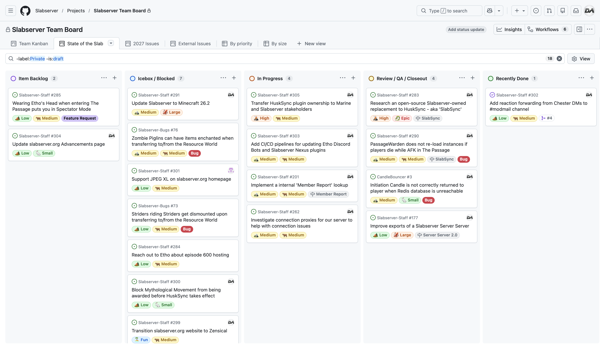

# June 2026
<!-- more -->
### Donation Breakdown
**Breakdown Between 1st Of May - 31st Of May:**

Costs/Donations |      $
---|---
Monthly Paypal Donations¹| $3.53
Monthly Patreon Donations¹| $121.88
Total Donations (Month)| $125.41
Existing Rollover Donations| $1029.23
---|---
Dedicated Hetzner Server Cost² | -$137.04
---|---
**Remaining Donation Funds**³   |  **$1017.60**

---

### State of the Slab

**Current staff tasks being tracked as of 1st June 2026⁴⁵:**

**Here's a recap of the staff team actions throughout the last month:**

- I have officially taken ownership of the HuskSync plugin in support of Slabserver, to maintain the open-source plugin for future Minecraft versions and support our own Slabserver upgrades.
    - This opportunity came about as our staff team were struggling to upgrade our servers to Minecraft 26.1 because of HuskSync's lack of official updates, and started to plan 'SlabSync', our own custom replacement that hoped to address HuskSync's shortcomings and lack of support.
    - As we affirmed that SlabSync ultimately aimed to fix HuskSync's shortcomings rather than fundamentlaly rearchitect anything.  I then reached out to HuskSync's developer to get clarification on its future, and our discussions led to the opportunity of complete creative control and ownership over HuskSync.
    - This is a huge step for us and one that I'm incredibly proud of, both personally and on Slabserver's behalf. We were offered ownership over HuskSync in no small part thanks to the reputation that our staff team and community has, and it's a testament to just how much we've grown since 2015.

- We've added support for forwarding reactions to Chester, our modmail bot, to our staff `#modmail` channel, after the feature suggestion was made earlier this year in our `#feedback` channel.

- We've made some minor adjustments to our [Slabserver-Bugs](https://github.com/Slabserver/Slabserver-Bugs/issues) templates - namely reducing the amount of field inputs when creating a new Bug Report, preventing blank issues from being opened to prioritise the Bug Report template, and adding additional contact link options for security related issues.

- We've done some housecleaning with our Cloudflare DNS entries, to remove several records that were only used during our dedicated server migration from Ionos in 2024. These managed to cause some recent confusion for some members that found them, and have now been removed.

- We've made some minor adjustments to our Backblaze account - namely fixing an issue where the daily backups weren't auto-deleting after seven days, and updating some billing information. N.B. Currently I still cover these backup costs, rather than billing from the Slabserver donation funds.

---

### Server Donation Links
Paypal: [https://slabserver.org/paypal](https://slabserver.org/paypal)

Patreon: [https://slabserver.org/patreon](https://slabserver.org/patreon)

---

¹ Donation amount listed is after transaction fees have taken place.

² The dedicated server hosts all of our game servers, databases, as well as our various Discord bots. You can find more detail on this [in our documentation](../../../documentation/minecraft/server-architecture.md).

³ Unless disclosed otherwise, this will always be put forward towards next months server costs, and will be displayed in ‘rollover donations’ within the transparency report.

⁴ There will be occasions that certain items on the board are redacted, should they still be in [draft](https://docs.github.com/en/issues/planning-and-tracking-with-projects/managing-items-in-your-project/adding-items-to-your-project#creating-draft-issues), or contain sensitive tasks or information.

⁵ The [Priority](../../../assets/images/kanban/Priority.png) and [Size](../../../assets/images/kanban/Size.png) labels for our State of the Slab Board are a rough estimate of the amount of work involved, and quite honestly are just assigned based on vibes.
