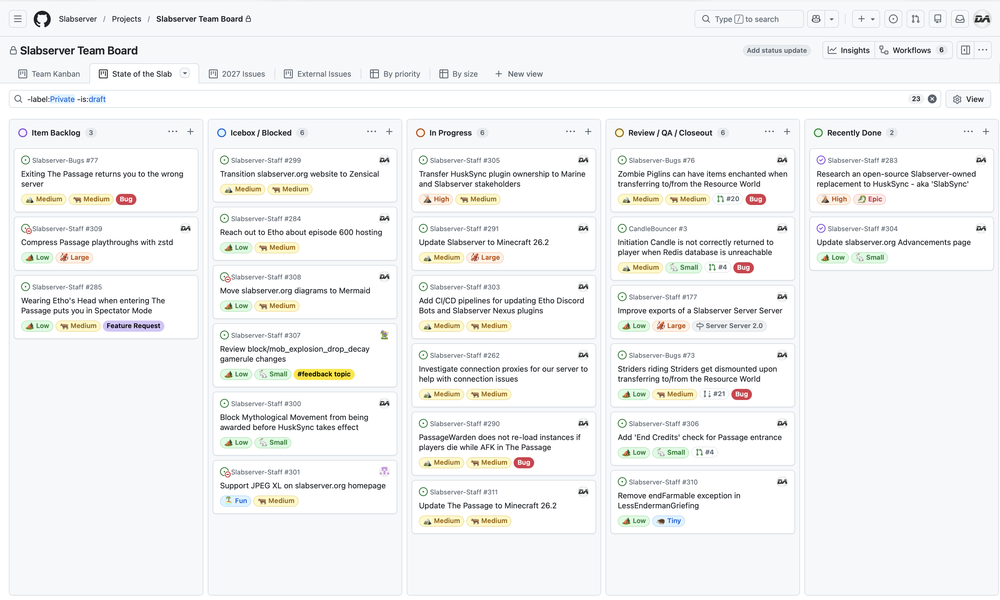

# July 2026
<!-- more -->
### Donation Breakdown
**Breakdown Between 1st Of June - 31st Of June:**

Costs/Donations |      $
---|---
Monthly Paypal Donations¹| $3.53
Monthly Patreon Donations¹| $121.71
Total Donations (Month)| $125.24
Existing Rollover Donations| $1017.60
---|---
Dedicated Hetzner Server Cost² | -$134.41
---|---
**Remaining Donation Funds**³   |  **$1,008.43**

[Backblaze](./../../../documentation/minecraft/server-architecture.md#backups) costs in July were $11.57. This expense is currently not paid for via the server donation funds.

---

### State of the Slab

**Current staff tasks being tracked as of 1st July 2026⁴⁵:**

**Here's a recap of the staff team actions throughout the last month:**

- We've worked with some very talented community members to create a Pride-themed minigame known as Beetho Pride Mayhem! Thanks to everyone who contributed to this project, or took part in a gamenight event for it <3
    - There's a couple more events currently scheduled, and we'll ensure that it remains available for everyone to play in the future.

- We also hosted another **State of the Slab Live** to discuss the current Staff kanban board in more detail. The recording can be found [over on YouTube](https://www.youtube.com/playlist?list=PLAD59jwNidoAl1wpxzRyl1imds12-ppGW).

- We've setup some internal [Jenkins](https://www.jenkins.io) pipelines to help us build and deploy plugins more efficiently to servers. This is still in early stages of setup, and only used for a handful of plugins on the Nexus and Staging servers, but we expect its use to gradually be expanded over time.

- We've updated our Member Report feature with a new selection menu for choosing members to report, rather than just using a simple text field entry.
    - This makes it clearer that multiple members can be reported, and our `#modmail` channel now includes an `@` mention of the reported members(s) - which means the bot can quickly lookup the total number of reports a member has recieved over time.
    - As part of these changes, we also fixed a bug where any in-progress Member Report would cause other users using Chester to get incorrect output messages when sending a modmail.

- We updated several pages on [slabserver.org](https://slabserver.org):
    - Added the full list of [Season 4 custom advancements](../../../documentation/minecraft/tweaks/custom-advancements.md)
    - Fixed the naming of modmailbot in our [server architecture](../../../documentation/minecraft/server-architecture.md#bots)
    - Fixed the download link for Slabserver's [Enigmatica 2](../../../documentation/general/downloads.md#minecraft-modded-seasons) playthrough
    - Fixed and updated the download link for Slabserver's [Season 4 Voxy LODs](../../../documentation/general/downloads.md#minecraft-smp-seasons)
    - Updated the [Assets & Downloads](../../../documentation/general/downloads.md) page links to all use HTTPS instead of HTTP
    - Updated the [Initiation Candle](../../../documentation/minecraft/tweaks/initiation-candle.md) page with advancement hints for accessing The Passage

- We've backed up and purged the Creative server's CoreProtect database, after the amount of logs had grown to 90% of the server's disk space. Interestingly, the last time we had to do this was almost exactly 5 years ago, only out by one day.

- We made some minor formatting changes to the `/ip` command in our Discord, allowing us to format some server addresses (such as our Proxy or Bedrock connections for Survival) as superscript.

- We made an auto-update script for [Geyser](https://geysermc.org), to ensure that we always support the latest versions of Bedrock clients on our Survival server.
    - This does, however, require Survival to be updated to the latest version as well - our 26.2 update is _almost_ complete on Staging, so watch this space!

---

### Server Donation Links
Paypal: [https://slabserver.org/paypal](https://slabserver.org/paypal)

Patreon: [https://slabserver.org/patreon](https://slabserver.org/patreon)

---

¹ Donation amount listed is after transaction fees have taken place.

² The dedicated server hosts all of our game servers, databases, as well as our various Discord bots. You can find more detail on this [in our documentation](../../../documentation/minecraft/server-architecture.md).

³ Unless disclosed otherwise, this will always be put forward towards next months server costs, and will be displayed in ‘rollover donations’ within the transparency report.

⁴ There will be occasions that certain items on the board are redacted, should they still be in [draft](https://docs.github.com/en/issues/planning-and-tracking-with-projects/managing-items-in-your-project/adding-items-to-your-project#creating-draft-issues), or contain sensitive tasks or information.

⁵ The [Priority](../../../assets/images/kanban/Priority.png) and [Size](../../../assets/images/kanban/Size.png) labels for our State of the Slab Board are a rough estimate of the amount of work involved, and quite honestly are just assigned based on vibes.
