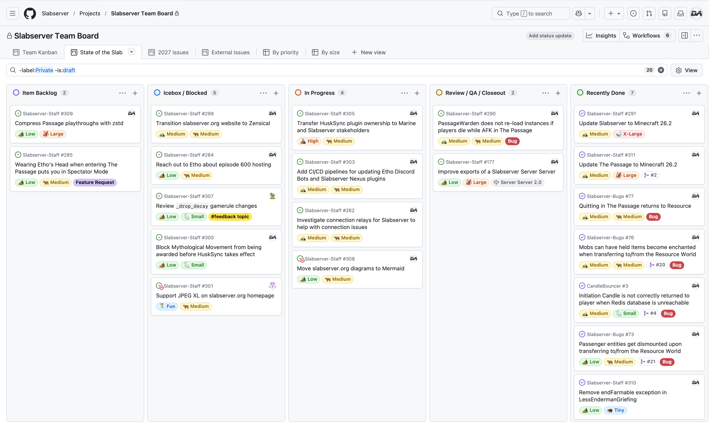

# August 2026
<!-- more -->
### Donation Breakdown
**Breakdown Between 1st Of July - 31st Of July:**

Costs/Donations |      $
---|---
Monthly Paypal Donations¹| $3.53
Monthly Patreon Donations¹| $115.04
Total Donations (Month)| $118.57
Existing Rollover Donations| $1,008.43
---|---
Dedicated Hetzner Server Cost² | -$135.69
---|---
**Remaining Donation Funds**³   |  **$991.31**

[Backblaze](./../../../documentation/minecraft/server-architecture.md#backups) costs in July were $14.60. This expense is currently not paid for via the server donation funds.

---

### State of the Slab

**Current staff tasks being tracked as of 5th August 2026⁴⁵:**

**Here's a recap of the staff team actions throughout the last month:**

- We updated Slabserver to Minecraft 26.2, and upgraded the majority of our plugins and datapacks to be compatible with this version. You can find the full patchnotes in our [#announcements](https://discord.com/channels/146701388234227712/146702455487463424/1528188433883992175) channel.
    - This has been our most convoluted and time-consuming server upgrade to date, and has required more plugin updates - both our own, and compiling/updating other people's plugins - than any other server upgrade we've done in the past. Some of this stems from the (hopefully) rare occasion of having to upgrade through multiple versions, and 26.1 was the cause of most breaking changes.
        - Some of these hurdles stem from us trying to upgrade to 26.2 as soon as we realistically could, both for the benefit of our community members but also from the desire to fall too far behind Mojang's release cadence. We can only hope that Mojang had the foresight to avoid any more major breaking changes for the foreseeable future.

- We updated The Passage to Minecraft 26.2, and in the process added several quality-of-life improvements and important bugfixes. You can find the full patchnotes in our [#s4-puzzle](https://discord.com/channels/146701388234227712/614586586104987671/1528187611657535558) channel.
    - These bugfixes, and all block-related bugfixes since the puzzle's launch last April, are now included as standard in new Passage playthroughs. Previously, these were 'patched' in as players progressed through the puzzle and interacted with Soul Campfires, but by including these as standard it ensures the minor bugfixes cannot be missed.
    - In the rare case anyone is attempting any% speedruns for The Passage and wants to use the original v1.0.0 version, it can still be accessed by using `indevs` or `1.0.0` in the name for an Initiation Candle.

- We formally announced our Relay network (previously known as our Proxy) after a recent rename to reduce confusion with our own [Proxy server](../../../documentation/minecraft/server-architecture.md#proxy-network), and updated all relevant documentation.
    - We will be asking for feedback on player experiences with the Relay soon, to better understand whether certain regions need another Relay location/route closer to their location.

- We fixed several bugs related to the Resource World as part of our 26.2 server upgrade, including:
    - [Mobs can have held items become enchanted when transferring to/from the Resource World](https://github.com/Slabserver/Slabserver-Bugs/issues/76)
    - [Passenger entities get dismounted upon transferring to/from the Resource World](https://github.com/Slabserver/Slabserver-Bugs/issues/73)
    - [Quitting the game while in The Passage returns players to the Resource World](https://github.com/Slabserver/Slabserver-Bugs/issues/77)

- We updated our Music Bot to its [latest version](https://github.com/arif-banai/MusicBot/releases/tag/v0.7.0), which introduces a number of UX improvements such as slash commands and interactive messages.
    - Please note that while the Music Bot may be a little better, this still does not mean that the Music Bot works _well_.
---

### Server Donation Links
Paypal: [https://slabserver.org/paypal](https://slabserver.org/paypal)

Patreon: [https://slabserver.org/patreon](https://slabserver.org/patreon)

---

¹ Donation amount listed is after transaction fees have taken place.

² The dedicated server hosts all of our game servers, databases, as well as our various Discord bots. You can find more detail on this [in our documentation](../../../documentation/minecraft/server-architecture.md).

³ Unless disclosed otherwise, this will always be put forward towards next months server costs, and will be displayed in ‘rollover donations’ within the transparency report.

⁴ There will be occasions that certain items on the board are redacted, should they still be in [draft](https://docs.github.com/en/issues/planning-and-tracking-with-projects/managing-items-in-your-project/adding-items-to-your-project#creating-draft-issues), or contain sensitive tasks or information.

⁵ The [Priority](../../../assets/images/kanban/Priority.png) and [Size](../../../assets/images/kanban/Size.png) labels for our State of the Slab Board are a rough estimate of the amount of work involved, and quite honestly are just assigned based on vibes.
