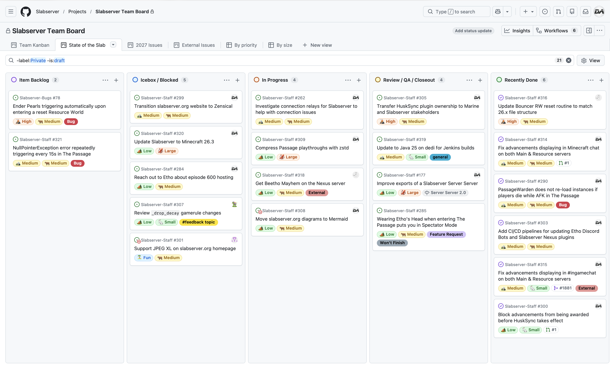

# September 2026
<!-- more -->
### Donation Breakdown
**Breakdown Between 1st Of August - 31st Of August:**

Costs/Donations |      $
---|---
Monthly Paypal Donations¹| $3.53
Monthly Patreon Donations¹| $103.72
Total Donations (Month)| $107.25
Existing Rollover Donations| $991.31
---|---
Dedicated Hetzner Server Cost² | -$137.34
---|---
**Remaining Donation Funds**³   |  **$961.22**

[Backblaze](../../../documentation/minecraft/server-architecture.md#backups) costs in December were $xx.xx. This expense is currently not paid for via the server donation funds.

---

### State of the Slab

**Current staff tasks being tracked as of 1st September 2026⁴⁵:**

**Here's a recap of the staff team actions throughout the last month:**

- We fixed our Survival server's Advancement messages appearing twice in chat on both the Main World and Resource World, and managed to fix this on both our Minecraft and Discord chat.
    - Special thanks to the DiscordSRV devs for accepting our [pull request](https://github.com/DiscordSRV/DiscordSRV/pull/1881) to support this behaviour natively, and in doing so allow other Minecraft communities to benefit from this change as well.
    - For over a year we'd thought there was no reasonable fix without hacky fixes or tradeoffs as a result, so we're very happy to have taken another look at it and put this one to rest!
- We conducted some minor downtime and maintenance on our dedicated server, in order to upgrade its operating system to Debian 13.
    - As part of this maintenance, we're hopeful that the infrequent crashes that have occurred recently will also be addressed.
- We fixed part of the Resource World reset routine in order to match some of Minecraft's file structure changes made in 26.1, just in time for the reset that took place several days ago.
---

### Server Donation Links
Paypal: [https://slabserver.org/paypal](https://slabserver.org/paypal)

Patreon: [https://slabserver.org/patreon](https://slabserver.org/patreon)

---

¹ Donation amount listed is after transaction fees have taken place.

² The dedicated server hosts all of our game servers, databases, as well as our various Discord bots. You can find more detail on this [in our documentation](../../../documentation/minecraft/server-architecture.md).

³ Unless disclosed otherwise, this will always be put forward towards next months server costs, and will be displayed in ‘rollover donations’ within the transparency report.

⁴ There will be occasions that certain items on the board are redacted, should they still be in [draft](https://docs.github.com/en/issues/planning-and-tracking-with-projects/managing-items-in-your-project/adding-items-to-your-project#creating-draft-issues), or contain sensitive tasks or information.

⁵ The [Priority](../../../assets/images/kanban/Priority.png) and [Size](../../../assets/images/kanban/Size.png) labels for our State of the Slab Board are a rough estimate of the amount of work involved, and quite honestly are just assigned based on vibes.
